# Documentação Técnica — EDA COVID-19 com Apache Spark

**Disciplina:** Processamento de Grande Volume de Dados — UVV  
**Dataset:** Our World in Data — COVID-19 (~570 mil registros, 61 colunas)  
**Período coberto:** Janeiro/2020 → Fevereiro/2026

---

## Sumário

1. [Visão Geral do Projeto](#1-visão-geral-do-projeto)
2. [Arquitetura e Fluxo de Dados](#2-arquitetura-e-fluxo-de-dados)
3. [Pipeline ETL — `src/main.py`](#3-pipeline-etl--srcmainpy)
   - [Módulo 1 — Configuração do Ambiente](#módulo-1--configuração-do-ambiente-java--sparksession)
   - [Módulo 2 — Extração (Extract)](#módulo-2--extração-extract)
   - [Módulo 3 — Qualidade dos Dados](#módulo-3--análise-de-qualidade-dos-dados)
   - [Módulo 4 — Transformação (Transform)](#módulo-4--transformação-transform)
   - [Módulo 5 — Window Function (Média Móvel)](#módulo-5--window-function--média-móvel)
   - [Módulo 6 — Agregações Analíticas](#módulo-6--agregações-analíticas)
   - [Módulo 7 — Carga (Load)](#módulo-7--carga-load)
4. [Notebook EDA — `notebook/main.ipynb`](#4-notebook-eda--notebookmainipynb)
5. [As 15 Visualizações — Explicação e Motivação](#5-as-15-visualizações--explicação-e-motivação)
6. [Conceitos de Big Data Aplicados](#6-conceitos-de-big-data-aplicados)
7. [Guia de Apresentação em Sala](#7-guia-de-apresentação-em-sala)

---

## 1. Visão Geral do Projeto

O projeto realiza uma **Análise Exploratória de Dados (EDA)** sobre a pandemia de COVID-19 usando o **Apache Spark** (via PySpark) para processar um dataset de grande volume.

O trabalho está dividido em dois entregáveis complementares:

| Arquivo | Papel | Público |
|---|---|---|
| `src/main.py` | Pipeline ETL automatizado — extrai, transforma e exporta dados | Execução em produção / servidor |
| `notebook/main.ipynb` | Análise interativa com visualizações | Exploração / apresentação |

---

## 2. Arquitetura e Fluxo de Dados

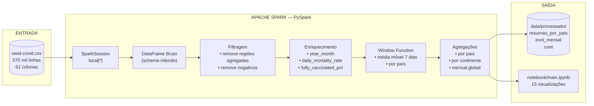

### Por que usar Spark para esse dataset?

Mesmo com ~570 mil linhas (tamanho moderado), usar Spark aqui demonstra os **princípios de processamento distribuído** que escalam para bilhões de registros. O mesmo código rodaria em um cluster sem modificações.

---

## 3. Pipeline ETL — `src/main.py`

O arquivo `src/main.py` é um **job Spark** standalone que implementa as três fases clássicas de processamento de dados:

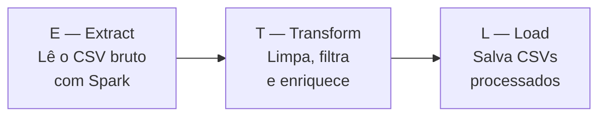

---

### Módulo 1 — Configuração do Ambiente (Java + SparkSession)

```python
# Auto-detecção do JAVA_HOME a partir do JDK instalado via install-jdk
if not os.environ.get("JAVA_HOME"):
    jdk_base = os.path.expanduser("~/.jdk")
    ...
    os.environ["JAVA_HOME"] = os.path.join(jdk_base, entradas[0])
```

**Por que esse código existe?**

O PySpark é uma biblioteca Python que, por baixo dos panos, inicia uma **JVM (Java Virtual Machine)** para executar o Spark. Sem o Java configurado, o programa não consegue iniciar.

Usamos o pacote `install-jdk` para **embutir o Java como dependência Python**, eliminando a necessidade de instalar Java manualmente no sistema operacional.

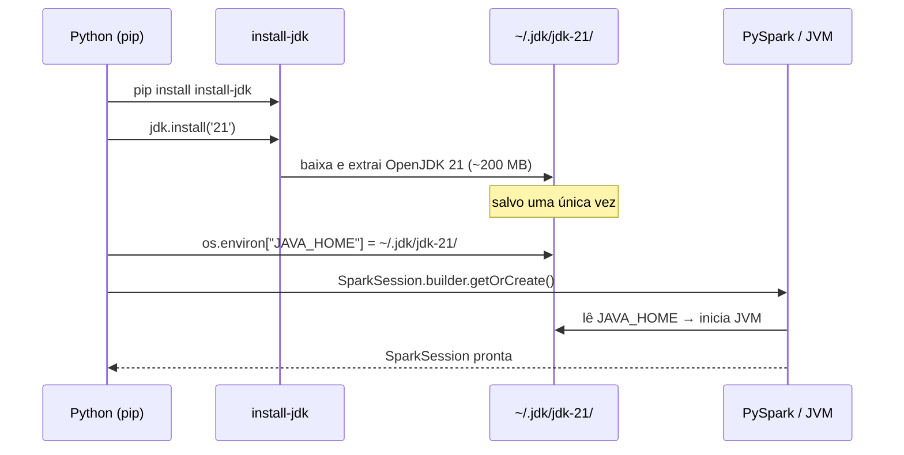

A `SparkSession` é o **ponto de entrada** de qualquer aplicação Spark. Ela gerencia a conexão com o cluster (aqui `local[*]` = todos os núcleos do computador local).

---

### Módulo 2 — Extração (Extract)

```python
df = (
    spark.read
    .option("header", "true")
    .option("inferSchema", "true")
    .csv(caminho)
)
df = df.withColumn("date", F.to_date(F.col("date"), "yyyy-MM-dd"))
```

**O que acontece aqui?**

O Spark lê o CSV de forma distribuída — internamente ele divide o arquivo em **partições** que poderiam ser processadas em paralelo em múltiplos nós de um cluster. Nesta execução local, as partições são processadas nos diferentes núcleos da CPU.

- `inferSchema` faz o Spark amostrar os dados para descobrir os tipos automaticamente (int, double, string, etc.)
- `to_date` converte a string `"2020-03-15"` para o tipo nativo `DateType` do Spark

**Resultado:** um DataFrame com 570.606 linhas × 61 colunas, totalmente tipado.

---

### Módulo 3 — Análise de Qualidade dos Dados

```python
exprs_nulos = [
    F.sum(F.col(c).isNull().cast("int")).alias(c)
    for c in colunas_interesse
]
resultado = df.agg(*exprs_nulos).collect()[0].asDict()
```

**Truque do Spark:** em vez de fazer uma query por coluna (61 queries), construímos **uma lista de expressões** e executamos tudo em uma única passagem pelo dataset. Isso é muito mais eficiente.

**Principais achados de qualidade:**

| Coluna | % Nulos | Por quê |
|---|---|---|
| `icu_patients` | 93% | Poucos países reportam UTI diariamente |
| `hosp_patients` | 93% | Idem — hospitalizações |
| `people_fully_vaccinated` | 87% | Vacinação começou apenas em Dec/2020 |
| `reproduction_rate` | 68% | Estimativa complexa, nem sempre calculada |
| `new_cases` | 3% | Registros antes do início da pandemia |

---

### Módulo 4 — Transformação (Transform)

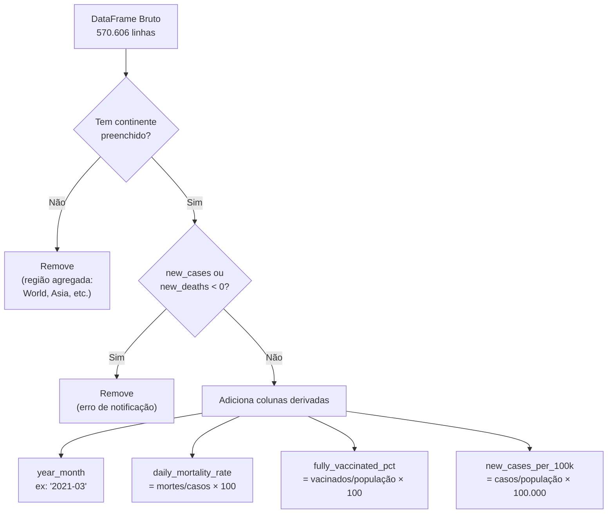

**Por que remover as regiões agregadas?**

O dataset OWID inclui registros especiais como `"World"`, `"High income"`, `"European Union"` que são **somas de países** — não países reais. Mantê-los duplicaria os dados nas análises.

**Por que criar colunas derivadas?**

As colunas derivadas transformam dados brutos em **métricas analíticas**:
- `fully_vaccinated_pct` permite comparar países de tamanhos diferentes
- `daily_mortality_rate` mede gravidade independente do volume de casos
- `year_month` agrupa os dados em granularidade mensal

---

### Módulo 5 — Window Function — Média Móvel

```python
window_spec = (
    Window
    .partitionBy("country")           # cada país é independente
    .orderBy(F.unix_date(F.col("date")))  # ordena por data
    .rowsBetween(-6, 0)               # janela: 7 dias (atual + 6 anteriores)
)
df = df.withColumn("new_cases_ma7", F.avg("new_cases").over(window_spec))
```

**O que é uma Window Function?**

Ela calcula um valor para cada linha levando em conta um **conjunto de linhas vizinhas** — sem colapsar o DataFrame (diferente do `groupBy`).

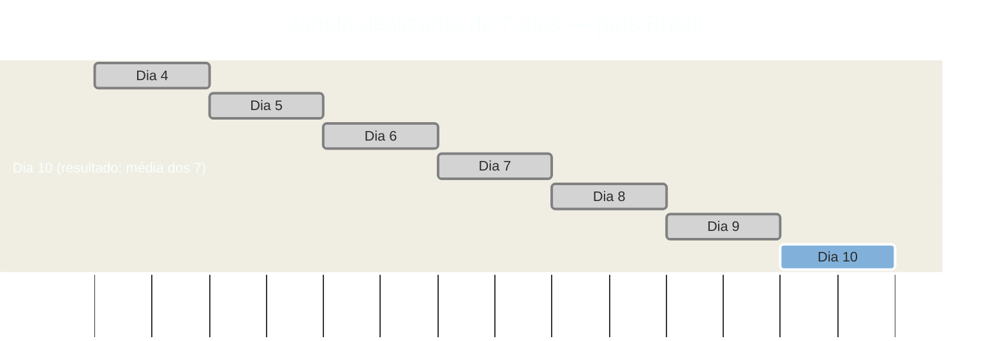


**Por que usar média móvel de 7 dias?**

Dados diários de COVID tinham **ruído alto** — fins de semana tinham subnotificação, e segundas-feiras tinham picos artificiais de compensação. A média móvel de 7 dias suaviza esse ruído semanal e revela a tendência real.

**`unix_date()` em vez de `.cast("long")`:**  
O Spark 4.x não permite converter `DateType` diretamente para `BIGINT`. A função `unix_date()` retorna o número de dias desde 1970-01-01 (tipo `IntegerType`), que é o que o `Window.orderBy()` precisa para ordenação numérica correta.

---

### Módulo 6 — Agregações Analíticas

Três agregações são geradas para análises em diferentes granularidades:

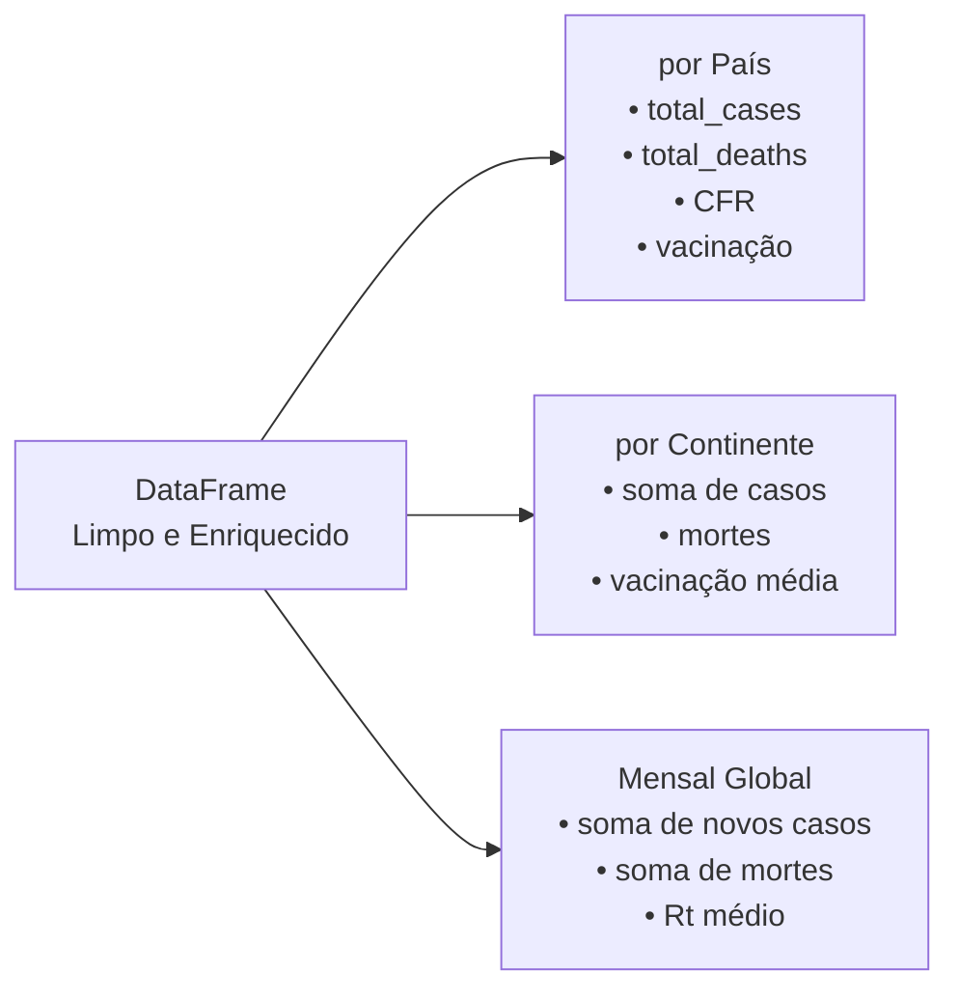

**Case Fatality Rate (CFR)** — taxa de mortalidade acumulada:

```
CFR = (total_deaths / total_cases) × 100
```

> Importante: CFR ≠ taxa de mortalidade real. Ela é afetada pela **capacidade de testagem** do país — países com poucos testes têm CFR artificialmente alto.

---

### Módulo 7 — Carga (Load)

```python
df.coalesce(1).write.mode("overwrite").option("header", "true").csv(destino)
```

- `coalesce(1)` — consolida todas as partições em um único arquivo de saída
- `mode("overwrite")` — substitui resultados anteriores automaticamente
- Os arquivos são salvos em `data/processado/` (não versionados no Git)

---

## 4. Notebook EDA — `notebook/main.ipynb`

O notebook segue o mesmo pipeline de transformação do `main.py` e adiciona as visualizações. A estrutura é:

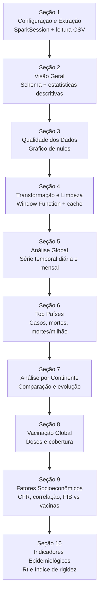

**Por que fazer `df.cache()`?**

Após a transformação, o DataFrame é reutilizado em ~10 células diferentes. Sem cache, o Spark recalcularia toda a transformação a cada consulta. Com cache, ele armazena o resultado em memória após a primeira computação.

---

## 5. As 15 Visualizações — Explicação e Motivação

### Figura 01 — Proporção de Valores Nulos por Coluna

**Tipo:** Gráfico de barras horizontais  
**O que mostra:** Percentual de valores ausentes em cada coluna do dataset.

**Por que fazer isso primeiro?**  
Antes de qualquer análise, é fundamental entender **o que não temos**. Uma análise construída sobre colunas 93% nulas seria estatisticamente inválida. Esta figura documenta as limitações do dataset e justifica por que certas análises (ex: internações em UTI) não foram aprofundadas.

**Achado principal:** `icu_patients` e `hosp_patients` têm 93% de nulos — dados hospitalares só foram reportados sistematicamente por países ricos.

---

### Figura 02 — Evolução Global Diária de Casos e Mortes

**Tipo:** Área + linha (média móvel 7 dias), dois subgráficos  
**O que mostra:** Série temporal de novos casos e novas mortes globais por dia.

**Por que este gráfico é fundamental?**  
É a visualização central de qualquer análise pandêmica. Permite identificar as **ondas** da pandemia e relacioná-las com variantes (Delta, Ômicron) e eventos como o início da vacinação.

**Como ler:** A área cinza mostra a variação diária bruta (ruidosa); a linha colorida é a média móvel de 7 dias (tendência real).

**Achado principal:** O pico de casos (Janeiro/2022, variante Ômicron) foi muito maior que os picos anteriores, mas com mortalidade proporcionalmente menor — sinal de eficácia vacinal.

---

### Figura 03 — Evolução Mensal Global (Barras + Linha)

**Tipo:** Gráfico de barras (casos) com eixo secundário de linha (mortes)  
**O que mostra:** Agregação mensal para visualizar tendências de longo prazo.

**Por que mensal além de diário?**  
O gráfico diário é muito "barulhento" para identificar padrões de longo prazo. A visão mensal revela claramente as **fases da pandemia** e permite comparar 2020, 2021 e 2022 com contexto.

**Técnica:** Eixo duplo (esquerda = casos em milhões; direita = mortes em milhares) para plotar magnitudes diferentes no mesmo gráfico.

---

### Figura 04 — Top 15 Países por Total de Casos

**Tipo:** Gráfico de barras horizontais com coloração por continente  
**O que mostra:** Ranking absoluto de países mais afetados.

**Limitação intencional desta métrica:**  
O total absoluto favorece países grandes. EUA (340M hab.) naturalmente aparece à frente de países menores. Esta figura existe para criar um **contexto de escala** antes das figuras normalizadas.

**Por continente:** A coloração revela que os países do topo são predominantemente da América do Norte, Europa e Ásia — padrão esperado dado o tamanho populacional e capacidade de testagem.

---

### Figura 05 — Top 15 Países por Total de Mortes

**Tipo:** Gráfico de barras horizontais  
**O que mostra:** Ranking de mortes absolutas.

**Por que mostrar casos e mortes separados?**  
Um país pode ter muitos casos e poucas mortes (boa infraestrutura de saúde, população jovem) ou vice-versa. Comparar os dois rankings revela diferenças na capacidade de resposta de cada sistema de saúde.

**Achado:** O Brasil aparece no top 3 em mortes, mesmo com menos casos que EUA ou China — indicando uma CFR mais alta.

---

### Figura 06 — Top 15 Países — Mortes por Milhão (Normalizado)

**Tipo:** Gráfico de barras horizontais  
**O que mostra:** Mortes corrigidas pelo tamanho da população.

**Por que esta métrica é mais justa?**  
Permite comparar um país de 10 milhões com um de 1 bilhão. Países pequenos da Europa (Peru, Bulgária, Hungria) que não aparecem nos rankings absolutos surgem aqui como muito impactados — revelando deficiências de sistemas de saúde específicos.

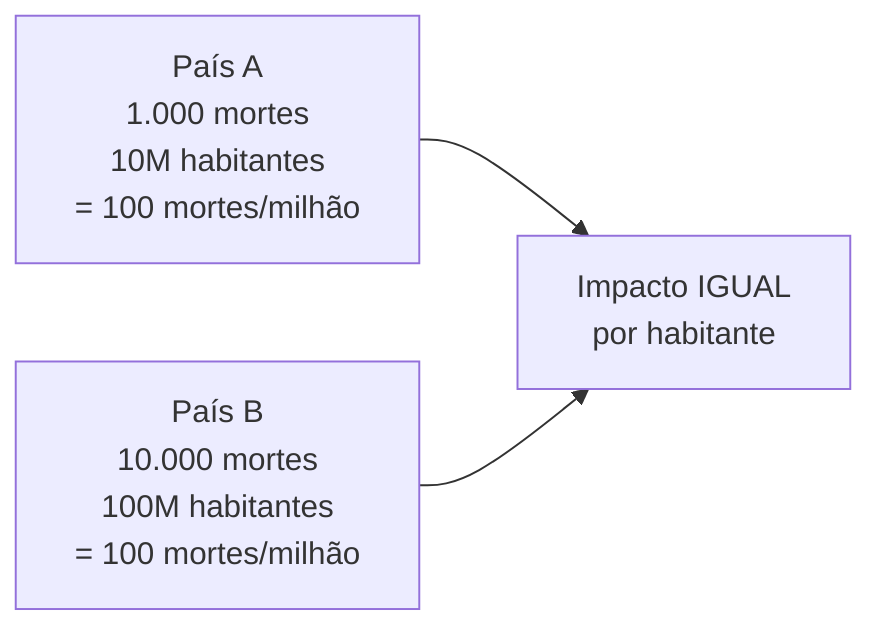

---

### Figura 07 — Análise por Continente (Total e Normalizado)

**Tipo:** Dois gráficos de barras verticais lado a lado  
**O que mostra:** Total de casos e mortes por milhão por continente.

**A inversão que esta figura revela:**  
A América do Norte lidera em casos totais, mas em mortes por milhão outros continentes podem aparecer de forma surpreendente. Esta comparação dupla (absoluto vs. normalizado) é um exemplo clássico de como a escolha da métrica muda a narrativa.

---

### Figura 08 — Evolução Mensal de Casos por Continente

**Tipo:** Gráfico de linhas múltiplas (multi-series)  
**O que mostra:** Como cada continente foi afetado ao longo do tempo.

**O que procurar:** As ondas não foram simultâneas — Europa foi afetada antes da América do Sul na primeira onda. A Ásia teve picos diferentes devido a políticas de zero-COVID (China). Esta figura mostra que a pandemia não foi um evento global homogêneo.

---

### Figura 09 — Doses de Vacina Administradas por Dia

**Tipo:** Área + linha (média móvel)  
**O que mostra:** Velocidade da campanha de vacinação global.

**Por que esta figura é importante para a narrativa?**  
Ela cria o **antes e depois**: ao colocar esta figura junto com a Figura 02, é possível observar visualmente que a queda das mortes (especialmente em 2021-2022) coincide com o aumento da vacinação.

**Achado:** O pico de vacinação ocorreu em meados de 2021, com mais de 40 milhões de doses/dia globalmente.

---

### Figura 10 — Top 20 Países por Cobertura Vacinal

**Tipo:** Gráfico de barras horizontais com linha de meta (70% OMS)  
**O que mostra:** Percentual da população com esquema completo.

**A linha dos 70%:** A OMS estabeleceu 70% como meta para atingir imunidade coletiva. Esta linha no gráfico torna imediatamente visível quais países atingiram a meta e quais ficaram abaixo.

**Filtro aplicado:** Países com menos de 1 milhão de habitantes foram excluídos (como San Marino, Gibraltar) para evitar distorções — países pequenos podem atingir 100% de vacinação muito mais facilmente.

---

### Figura 11 — CFR por Continente (Boxplot)

**Tipo:** Boxplot  
**O que mostra:** Distribuição da Taxa de Mortalidade de Casos (CFR) entre os países de cada continente.

**Como ler um boxplot:**

```
     ┌────────────────────────────────────────┐
     │  Mín  Q1  Mediana  Q3  Máx  + outliers │
     └────────────────────────────────────────┘
           |____[====|====]____|    o   o
          min   Q1  med  Q3  max  outliers
```

- A **caixa** contém 50% dos países (entre Q1 e Q3)
- A **linha central** é a mediana (metade dos países acima, metade abaixo)
- Os **pontos fora** são outliers — países com CFR muito diferente do padrão do continente

**Por que CFR varia tanto?**  
CFR depende de: capacidade de testagem (mais testes = mais casos detectados = CFR menor), qualidade do sistema de saúde, e estrutura etária da população.

---

### Figura 12 — Heatmap de Correlação Socioeconômica

**Tipo:** Heatmap de correlação (triangular inferior)  
**O que mostra:** Força da relação linear entre indicadores socioeconômicos e métricas da pandemia.

**Como interpretar:**
- Valor próximo de **+1 (verde):** correlação positiva forte
- Valor próximo de **-1 (vermelho):** correlação negativa forte
- Valor próximo de **0 (amarelo):** sem correlação linear

**Principais correlações esperadas e seus significados:**

| Par | Correlação esperada | Interpretação |
|---|---|---|
| PIB per capita × Vacinados (%) | Positiva | Países ricos vacinaram mais |
| PIB per capita × CFR | Negativa | Países ricos têm menor mortalidade |
| Expectativa de Vida × Casos/Milhão | Positiva | Países com população mais velha notificaram mais |
| Expectativa de Vida × CFR | Negativa | Melhor saúde → menor mortalidade relativa |

> **Nota:** Correlação ≠ Causalidade. O fato de "países mais ricos terem mais casos por milhão" não significa que riqueza causa COVID — significa que esses países testaram muito mais.

---

### Figura 13 — PIB per Capita vs Cobertura Vacinal (Scatter)

**Tipo:** Gráfico de dispersão com escala logarítmica no eixo X  
**O que mostra:** Relação entre riqueza do país e cobertura vacinal, com o tamanho do ponto proporcional à população.

**Por que escala logarítmica no eixo X?**  
O PIB per capita varia de ~$500 (países pobres) a ~$100.000 (países muito ricos). Em escala linear, todos os países pobres ficariam espremidos no canto esquerdo. A escala log distribui melhor os países ao longo do eixo.

**O que procurar:**  
A tendência geral é de que países mais ricos (eixo X maior) tendem a ter maior cobertura vacinal (eixo Y maior). Exceções são países que mesmo com PIB baixo tiveram campanhas eficientes, ou países ricos que tiveram resistência à vacinação.

---

### Figura 14 — Taxa de Reprodução (Rt) Global

**Tipo:** Linha com faixa de intervalo interquartil  
**O que mostra:** Evolução da transmissibilidade média do vírus ao longo do tempo.

**O que é Rt?**

```
Rt = 1.5  →  cada infectado transmite para 1,5 pessoas  →  pandemia crescendo
Rt = 1.0  →  cada infectado transmite para 1 pessoa     →  pandemia estável
Rt = 0.8  →  cada infectado transmite para 0,8 pessoas  →  pandemia recuando
```

**A linha vermelha em Rt = 1** é o **limiar crítico**: acima dela, a pandemia cresce exponencialmente; abaixo, ela recua.

**A faixa (Q25-Q75)** mostra a variação entre países — revela que enquanto alguns países controlavam a pandemia (Rt < 1), outros ainda estavam em crescimento no mesmo período.

---

### Figura 15 — Índice de Rigidez por Continente

**Tipo:** Linhas múltiplas ao longo do tempo  
**O que mostra:** Nível médio das medidas de restrição (lockdowns, máscaras, fechamento de escolas etc.) por continente.

**O que é o Stringency Index?**  
Criado pela Universidade de Oxford, é um índice de 0 a 100 que agrega medidas como: fechamento de escolas, fechamento de comércio, cancelamento de eventos, restrições de viagem e obrigatoriedade de máscara.

**O que procurar:**  
- O pico de rigidez em Abril/2020 (lockdowns iniciais em todo o mundo)
- A progressiva redução ao longo de 2021-2022 com a vacinação
- Diferenças entre continentes: Ásia tendeu a manter restrições por mais tempo

---

## 6. Conceitos de Big Data Aplicados

### MapReduce no contexto do Spark

O modelo MapReduce, pioneiro do Google (2004), é a base conceitual do processamento distribuído. O Spark o implementa de forma otimizada em memória.

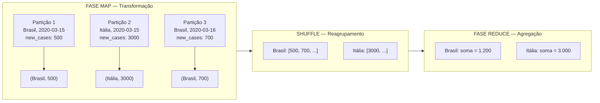

No Spark, o `groupBy("country").agg(F.sum("new_cases"))` executa internamente esse fluxo — sem que o programador precise gerenciar as partições manualmente.

---

### DataFrame API vs RDD

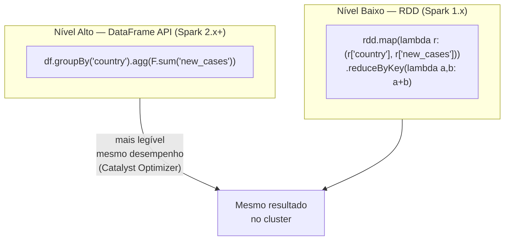

O **Catalyst Optimizer** do Spark transforma automaticamente as operações de DataFrame em um plano de execução otimizado — sem que o desenvolvedor precise se preocupar com detalhes de baixo nível.

---

### Lazy Evaluation (Avaliação Preguiçosa)

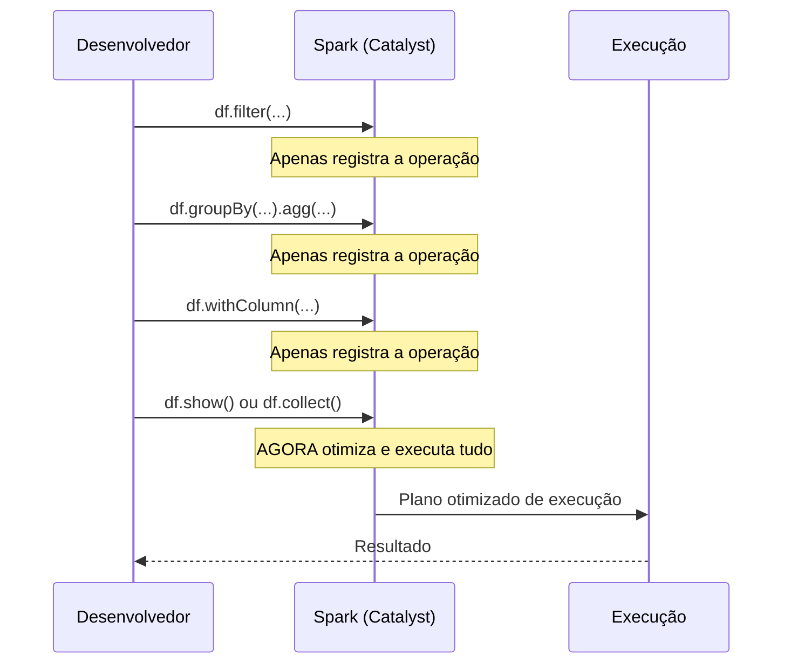

O Spark não executa nada até uma **ação** (`show()`, `collect()`, `count()`, `write`). Isso permite que o otimizador reorganize, combine e elimine operações redundantes antes de executar.

---

## 7. Guia de Apresentação em Sala

### Roteiro sugerido (15-20 minutos)

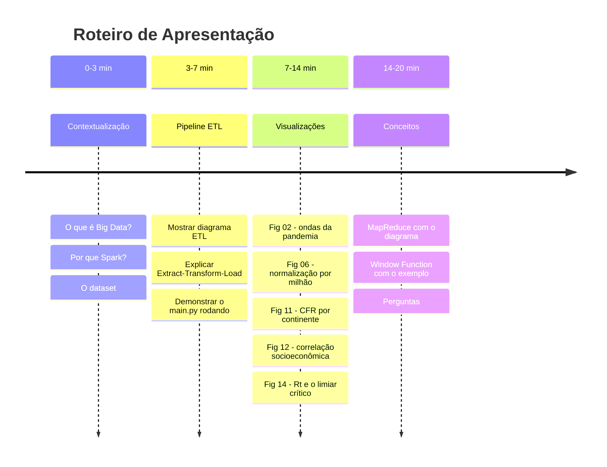

---

### Pontos-chave para defender cada escolha técnica

**"Por que Spark e não Pandas?"**
> Pandas carrega tudo em memória de uma máquina. Spark processa em partições distribuídas — o mesmo código escala para um dataset de 10 bilhões de linhas sem reescrever nada. Para aprender Big Data, é mais didático usar a ferramenta real.

**"Por que Window Function para a média móvel?"**
> Poderíamos usar Pandas com `.rolling()`, mas a Window Function do Spark demonstra um conceito fundamental de SQL analítico que existe em todos os bancos de dados modernos (PostgreSQL, BigQuery, Snowflake). É uma habilidade transferível.

**"Por que mortes por milhão e não mortes totais?"**
> Porque comparar Brasil (215M hab.) com Portugal (10M hab.) em termos absolutos é injusto. A normalização por população é o mínimo estatístico necessário para comparações internacionais.

**"Por que o heatmap de correlação?"**
> Para testar hipóteses socioeconômicas: "países mais ricos vacinaram mais?" (sim), "expectativa de vida alta significa mais casos?" (sim — porque países ricos testam mais), "PIB alto reduz mortalidade?" (sim, mas a correlação é moderada).

**"Por que o Rt?"**
> O Rt é o indicador mais importante para gestores de saúde pública — é o único que diz se uma epidemia está crescendo ou recuando *agora*, sem depender do volume histórico de casos.

---

### Perguntas que podem surgir e como responder

| Pergunta | Resposta |
|---|---|
| "O dataset é confiável?" | É do Our World in Data (Oxford/Global Change Data Lab), considerado a referência global. Mas tem limitações: países com pouca testagem têm dados subestimados. |
| "Por que China aparece com tantos casos?" | Após anos de política zero-COVID, a China liberou as restrições em Dec/2022 e reportou um surto massivo. Os dados refletem esse momento. |
| "CFR alto significa sistema de saúde ruim?" | Não necessariamente — CFR alto pode significar poucos testes (casos subnotificados). É uma métrica que precisa ser lida com contexto. |
| "Por que o Spark rodou localmente?" | Spark é um framework distribuído, mas funciona em modo local para desenvolvimento. Em produção, o mesmo código rodaria em um cluster AWS EMR, Databricks ou Google Dataproc sem modificações. |

---

*Documentação gerada em Abril/2026 — Projeto EDA COVID-19 — UVV*
