# Documentação Técnica — EDA COVID-19 com Apache Spark (PySpark Real)

**Disciplina:** Processamento de Grande Volume de Dados — UVV
**Dataset:** Our World in Data — COVID-19 (~570 mil registros, 61 colunas)
**Período coberto:** Janeiro/2020 → Fevereiro/2026
**Implementação:** Apache Spark real via PySpark 4.1.1 + Java 21

> Esta documentação cobre exclusivamente os arquivos que utilizam o **Apache Spark de verdade**:
> `src/main.py` e `notebook/main.ipynb`.
> Para a simulação em Python puro, consulte `DOCUMENTACAO_SIMULACAO.md`.

---

## Visão Geral

O projeto realiza uma **Análise Exploratória de Dados (EDA)** sobre a pandemia de COVID-19 usando o **Apache Spark** (via PySpark) para processar um dataset de grande volume.

| Arquivo | Papel |
|---|---|
| `src/main.py` | Pipeline ETL |
| `notebook/main.ipynb` | Análise interativa com visualizações |

---

## 2. Arquitetura e Fluxo de Dados

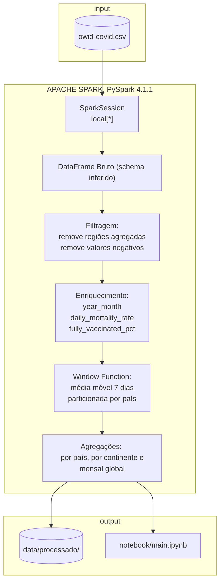

---

## 3. Pipeline ETL — `src/main.py`

O arquivo implementa as três fases clássicas de processamento de dados:

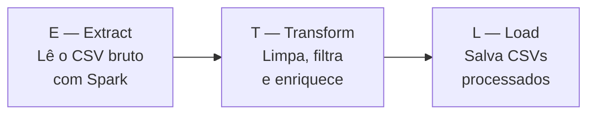

---

### Módulo 1 — Configuração do Ambiente (Java + SparkSession)

```python
# Auto-detecção do JAVA_HOME a partir do JDK instalado via install-jdk
if not os.environ.get("JAVA_HOME"):
    jdk_base = os.path.expanduser("~/.jdk")
    ...
    os.environ["JAVA_HOME"] = os.path.join(jdk_base, entradas[0])
```

O PySpark é uma biblioteca Python que, por baixo dos panos, inicia uma **JVM (Java Virtual Machine)** para executar o Spark. Sem o Java configurado, o programa não consegue iniciar.

Usamos o pacote `install-jdk` para **embutir o Java como dependência Python**, eliminando a necessidade de instalar Java manualmente no sistema operacional.

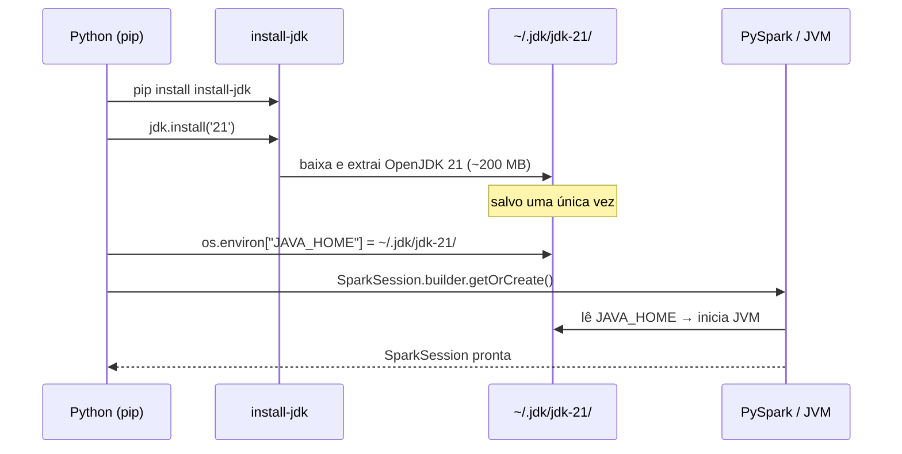

A `SparkSession` é o **ponto de entrada** de qualquer aplicação Spark. O padrão `builder.appName().master().getOrCreate()` cria ou reutiliza uma sessão existente.

---

### Módulo 2 — Extração (Extract)

```python
df = (
    spark.read
    .option("header", "true")
    .option("inferSchema", "true")
    .csv(caminho)
)
df = df.withColumn("date", F.to_date(F.col("date"), "yyyy-MM-dd"))
```

O Spark lê o CSV de forma distribuída — internamente divide o arquivo em **partições** processadas em paralelo nos núcleos da CPU. `inferSchema` faz o Spark amostrar os dados para detectar tipos automaticamente.

**Resultado:** DataFrame com 570.606 linhas × 61 colunas, totalmente tipado.

---

### Módulo 3 — Análise de Qualidade dos Dados

```python
exprs_nulos = [
    F.sum(F.col(c).isNull().cast("int")).alias(c)
    for c in colunas_interesse
]
resultado = df.agg(*exprs_nulos).collect()[0].asDict()
```

Em vez de fazer uma query por coluna (61 queries), constrói **uma lista de expressões** e executa tudo em uma única passagem. Isso é possível pelo modelo de **Lazy Evaluation** do Spark.

**Principais achados:**

| Coluna | % Nulos | Motivo |
|---|---|---|
| `icu_patients` | 93% | Poucos países reportam UTI diariamente |
| `hosp_patients` | 93% | Idem — hospitalizações |
| `people_fully_vaccinated` | 87% | Vacinação começou apenas em Dez/2020 |
| `reproduction_rate` | 68% | Estimativa complexa, nem sempre calculada |
| `new_cases` | 3% | Registros antes do início da pandemia |

---

### Módulo 4 — Transformação (Transform)

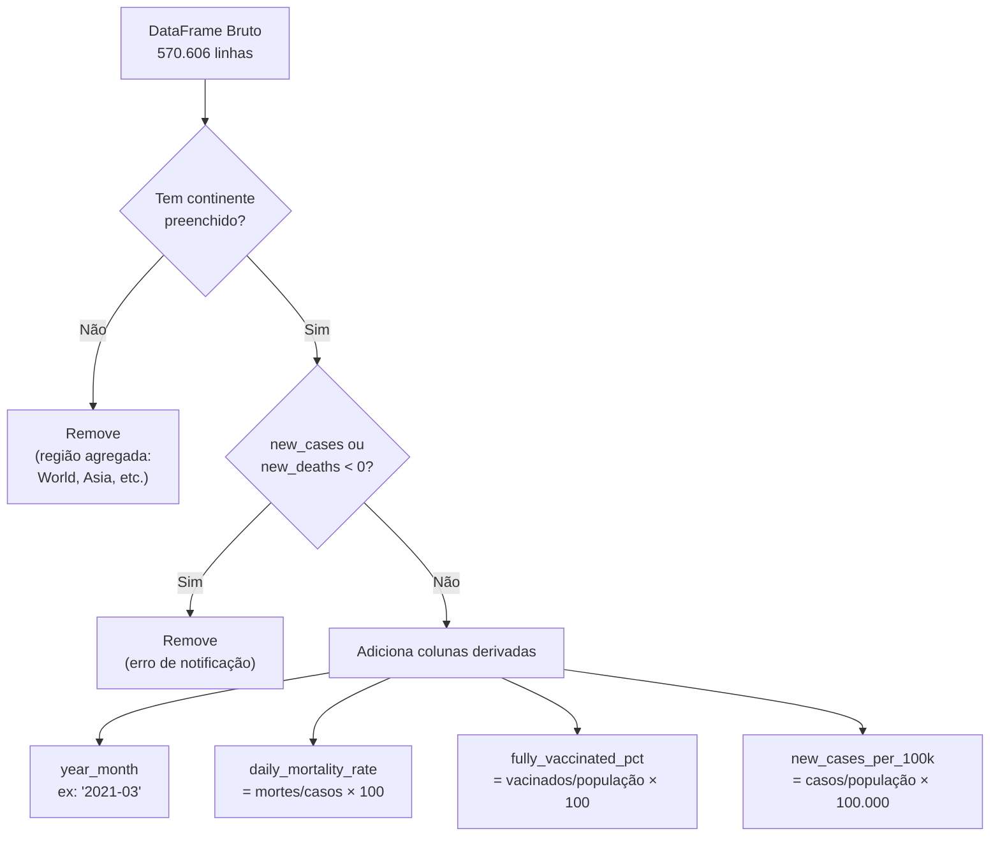

O dataset OWID inclui registros como `"World"`, `"High income"`, `"European Union"` que são **somas de países** — mantê-los duplicaria os dados nas análises.

---

### Módulo 5 — Window Function (Média Móvel)

```python
window_spec = (
    Window
    .partitionBy("country")               # cada país é independente
    .orderBy(F.unix_date(F.col("date")))  # ordena por data
    .rowsBetween(-6, 0)                   # janela: 7 dias
)
df = df.withColumn("new_cases_ma7", F.avg("new_cases").over(window_spec))
```

A Window Function calcula um valor para cada linha levando em conta **linhas vizinhas** — sem colapsar o DataFrame (diferente do `groupBy`).

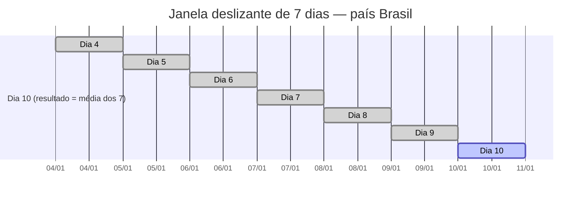

**`unix_date()` em vez de `.cast("long")`:** O Spark 4.x não permite converter `DateType` para `BIGINT`. A função `unix_date()` retorna dias desde 1970-01-01 como `IntegerType`, compatível com `Window.orderBy()`.

---

### Módulo 6 — Agregações Analíticas

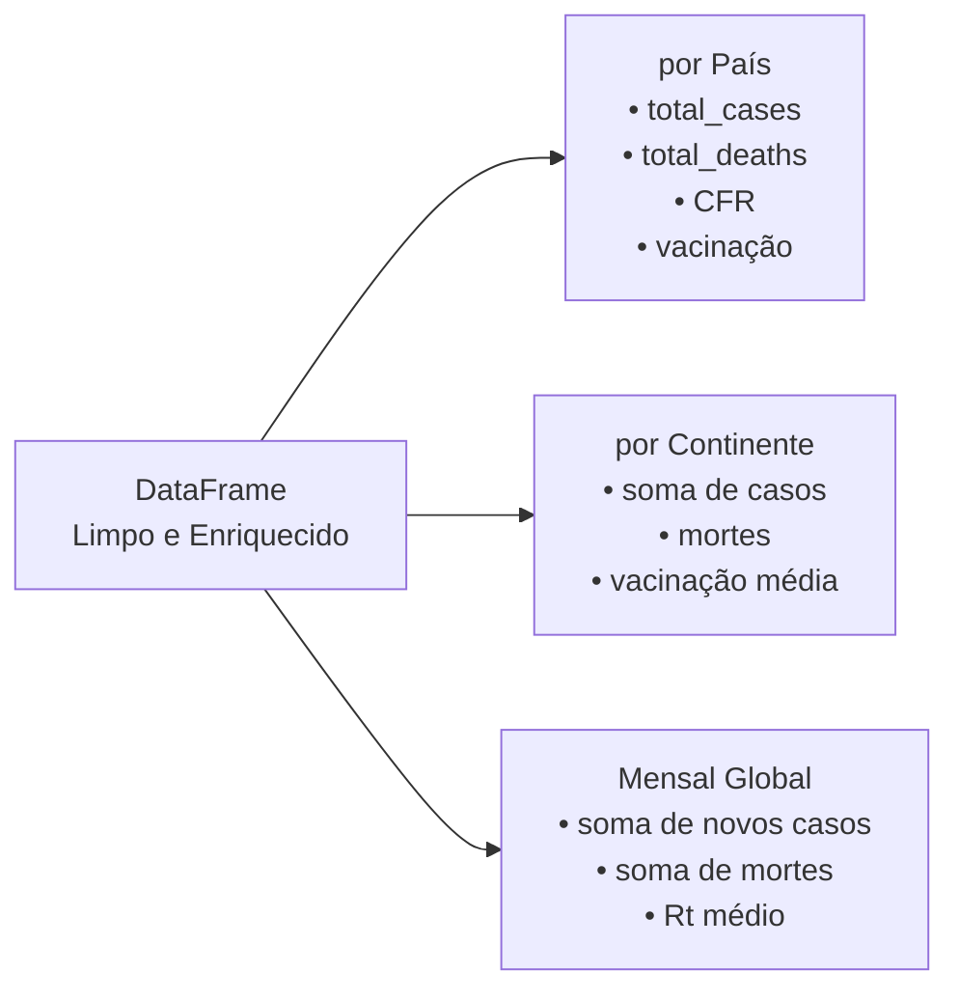

---

### Módulo 7 — Carga (Load)

```python
df.coalesce(1).write.mode("overwrite").option("header", "true").csv(destino)
```

- `coalesce(1)` — consolida todas as partições em um único arquivo CSV
- `mode("overwrite")` — substitui execuções anteriores automaticamente
- Saída em `data/processado/` (não versionado no Git por exceder 100 MB)

---

## 4. Notebook EDA — `notebook/main.ipynb`

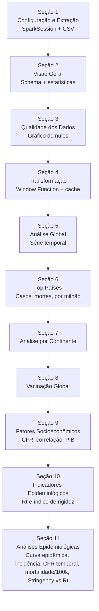

**Por que `df.cache()`?**
Após a transformação, o DataFrame é reutilizado em ~10 células. Sem cache, o Spark recalcularia toda a transformação a cada consulta. Com cache, armazena o resultado em memória após a primeira computação.

---

## 5. As 20 Visualizações

### Figura 01 — Proporção de Valores Nulos
**Tipo:** Barras horizontais | **Código:** `F.col(c).isNull().cast("int")`

Antes de qualquer análise é fundamental entender **o que não temos**. Esta figura documenta as limitações do dataset. `icu_patients` e `hosp_patients` têm 93% de nulos — dados hospitalares só foram reportados por países de alta renda.

---

### Figura 02 — Evolução Global Diária de Casos e Mortes
**Tipo:** Área + média móvel 7 dias, dois subgráficos

Visualização central da análise. Identifica as **ondas da pandemia** e relaciona com variantes (Delta, Ômicron) e vacinação. A área mostra a variação diária bruta; a linha é a média móvel (tendência real).

**Achado:** O pico de Janeiro/2022 (Ômicron) teve muito mais casos que os anteriores, mas mortalidade proporcionalmente menor — evidência do efeito vacinal.

---

### Figura 03 — Evolução Mensal Global
**Tipo:** Barras (casos) + eixo secundário linha (mortes)

O gráfico diário é muito ruidoso para padrões de longo prazo. A visão mensal revela claramente as fases da pandemia com contexto temporal.

---

### Figura 04 — Top 15 Países por Total de Casos
**Tipo:** Barras horizontais por continente

Ranking absoluto de países mais afetados. Cria contexto de escala antes das figuras normalizadas. Favorece países grandes — justificativa para a figura 06.

---

### Figura 05 — Top 15 Países por Total de Mortes
**Tipo:** Barras horizontais

Comparar os dois rankings (casos e mortes) revela diferenças na capacidade de resposta de cada sistema de saúde. O Brasil aparece no top 3 em mortes mesmo com menos casos que EUA — indicando CFR mais alta.

---

### Figura 06 — Top 15 Países — Mortes por Milhão
**Tipo:** Barras horizontais

Métrica normalizada por população para comparação justa entre países. Países pequenos da Europa (Peru, Bulgária) que não aparecem nos rankings absolutos surgem aqui como muito impactados.

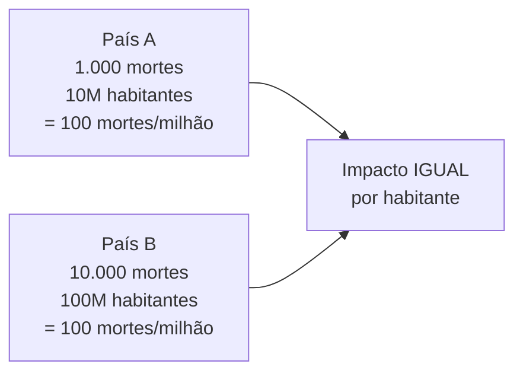

---

### Figura 07 — Análise por Continente
**Tipo:** Dois gráficos de barras lado a lado (absoluto vs. normalizado)

A comparação dupla mostra como a escolha da métrica muda a narrativa. América do Norte lidera em absolutos; outros continentes se destacam quando normalizado.

---

### Figura 08 — Evolução Mensal de Casos por Continente
**Tipo:** Linhas múltiplas

As ondas não foram simultâneas — Europa foi afetada antes da América do Sul na primeira onda. A Ásia teve padrões diferentes devido à política zero-COVID da China.

---

### Figura 09 — Vacinação Global ao Longo do Tempo
**Tipo:** Área + média móvel

Cria o **antes e depois**: a queda das mortes em 2021-2022 coincide visualmente com o aumento da vacinação. O pico foi ~40 milhões de doses/dia globalmente em meados de 2021.

---

### Figura 10 — Top 20 Países por Cobertura Vacinal
**Tipo:** Barras horizontais com linha de meta (70% OMS)

A OMS estabeleceu 70% como meta para imunidade coletiva. A linha torna imediatamente visível quais países atingiram a meta. Países com < 1M habitantes foram excluídos para evitar distorções.

---

### Figura 11 — CFR por Continente (Boxplot)
**Tipo:** Boxplot

```
     caixa = 50% dos países (Q1 a Q3)
     linha central = mediana
     pontos fora = outliers
```

CFR depende de capacidade de testagem (mais testes = CFR menor), qualidade do sistema de saúde e estrutura etária. Por isso varia tanto entre países.

---

### Figura 12 — Heatmap de Correlação Socioeconômica
**Tipo:** Heatmap com valores de correlação de Pearson

| Par | Correlação | Interpretação |
|---|---|---|
| PIB per capita × % Vacinados | Positiva | Países ricos vacinaram mais |
| PIB per capita × CFR | Negativa | Países ricos têm menor mortalidade |
| Expectativa de Vida × Casos/Milhão | Positiva | Países mais velhos notificaram mais |

> Correlação ≠ Causalidade.

---

### Figura 13 — PIB per Capita vs. Cobertura Vacinal
**Tipo:** Scatter com escala logarítmica no eixo X

PIB varia de ~$500 a ~$100.000 — escala log distribui melhor os países. A tendência confirma que países mais ricos tiveram maior cobertura vacinal.

---

### Figura 14 — Taxa de Reprodução (Rt) Global
**Tipo:** Linha com intervalo interquartil

```
Rt = 1.5  →  pandemia crescendo (cada infectado transmite para 1,5 pessoas)
Rt = 1.0  →  pandemia estável
Rt = 0.8  →  pandemia recuando
```

A linha vermelha em Rt = 1 é o **limiar crítico**. A faixa mostra variação entre países — enquanto alguns controlavam, outros ainda cresciam no mesmo período.

---

### Figura 15 — Índice de Rigidez por Continente
**Tipo:** Linhas múltiplas ao longo do tempo

O Stringency Index (Oxford) é um índice de 0 a 100 que agrega: fechamento de escolas, comércio, eventos, restrições de viagem e obrigatoriedade de máscara.

- Pico em Abril/2020: lockdowns iniciais
- Redução progressiva ao longo de 2021-2022 com a vacinação
- Ásia manteve restrições por mais tempo que outros continentes

---

### Figura 16 — Curva Epidêmica Semanal
**Tipo:** Barras semanais com faixas coloridas por onda | **Arquivo:** `16_curva_epidemica.png`

A curva epidêmica é a visualização mais clássica da epidemiologia: distribui os casos no tempo em intervalos regulares (aqui semanais) permitindo identificar o início, pico e declínio de cada onda. As faixas coloridas anotam as variantes predominantes em cada período.

| Onda | Período | Variante predominante |
|---|---|---|
| 1ª Onda | Jan/2020 a Jun/2020 | Cepa original |
| 2ª Onda | Jul/2020 a Fev/2021 | Alpha |
| 3ª Onda | Mar/2021 a Set/2021 | Delta |
| 4ª Onda | Out/2021 a Jun/2022 | Ômicron |
| Transição | Jul/2022 em diante | Subvariantes / endemia |

---

### Figura 17 — Taxa de Incidência por 100 mil Habitantes
**Tipo:** Linhas múltiplas por continente | **Arquivo:** `17_incidencia_100k.png`

A taxa de incidência é o indicador epidemiológico padrão para medir a intensidade de transmissão normalizada pela população. Calculada via PySpark: `groupBy("continent", "year_month").agg(F.sum("new_cases"))` dividido pela população máxima do continente × 100.000.

A diferença em relação ao total absoluto é fundamental: a Europa aparece com incidência muito maior que a Ásia, mesmo com população menor, revelando diferenças reais na propagação e não apenas no tamanho do país.

---

### Figura 18 — Coeficiente de Letalidade (CFR) Temporal
**Tipo:** Área com linha + marcadores de eventos | **Arquivo:** `18_cfr_temporal.png`

O CFR mensal é calculado como `F.sum("new_deaths") / F.sum("new_cases") * 100` agrupado por mês. Ao contrário do CFR estático por país, o CFR temporal mostra como a letalidade evoluiu ao longo da pandemia.

O gráfico marca dois eventos-chave:
- **Dezembro/2020:** início da vacinação em massa — CFR começa a cair
- **Outubro/2021:** chegada do Ômicron — CFR cai ainda mais (variante mais transmissível, mas menos letal)

Esta é a figura que mais claramente demonstra o impacto das vacinas e das variantes na mortalidade relativa.

---

### Figura 19 — Taxa de Mortalidade por 100 mil Habitantes
**Tipo:** Barras horizontais, top 20 países | **Arquivo:** `19_mortalidade_100k.png`

Diferente do CFR (que mede mortalidade entre os infectados), a taxa de mortalidade específica mede o impacto letal na população geral: `total_deaths / population * 100.000`. É o indicador que os sistemas de saúde pública usam para comparar o peso de doenças entre países.

Países com sistemas de saúde precários ou populações vulneráveis (idosas, com comorbidades) aparecem no topo independente do total absoluto de casos.

---

### Figura 20 — Eficácia das Políticas: Stringency vs. Rt
**Tipo:** Scatter por continente com linha de tendência | **Arquivo:** `20_stringency_vs_rt.png`

Relaciona a rigidez das restrições governamentais (Stringency Index) com a transmissibilidade do vírus (Rt) mês a mês por continente. Calculado via PySpark: `groupBy("continent", "year_month").agg(F.avg("stringency_index"), F.avg("reproduction_rate"))`.

O coeficiente de Pearson quantifica a força da correlação. A expectativa epidemiológica é de correlação negativa (mais restrições → menor Rt), mas o gráfico revela que a relação é mais complexa: há grande variação por continente e ao longo do tempo, refletindo diferenças na adesão populacional, capacidade de testagem e perfil das variantes.

---

## 6. Conceitos de Big Data Aplicados

### MapReduce

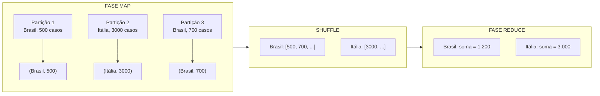

O `groupBy("country").agg(F.sum("new_cases"))` executa este fluxo internamente — sem que o programador gerencie partições.

---

### Lazy Evaluation

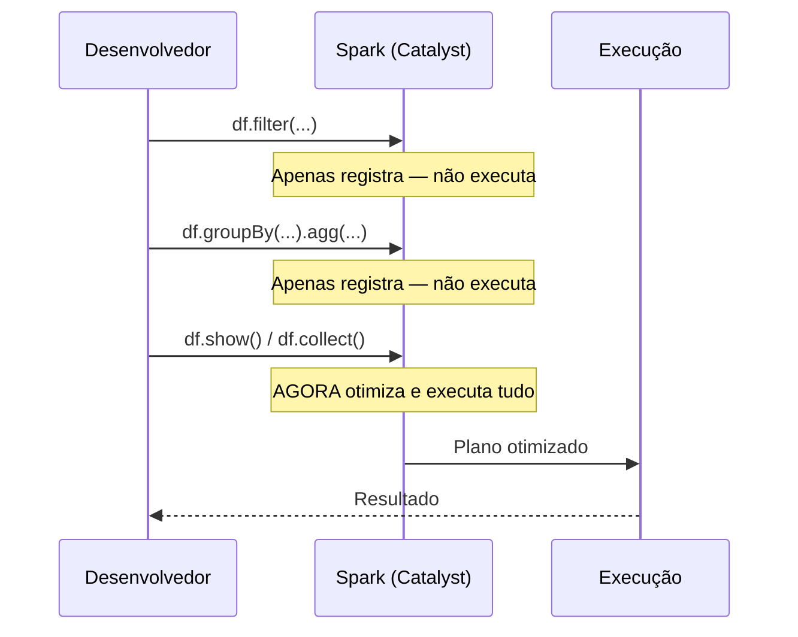

O Spark não executa nada até uma **ação**. Isso permite ao Catalyst Optimizer reorganizar, combinar e eliminar operações redundantes.

---

### DataFrame API vs RDD

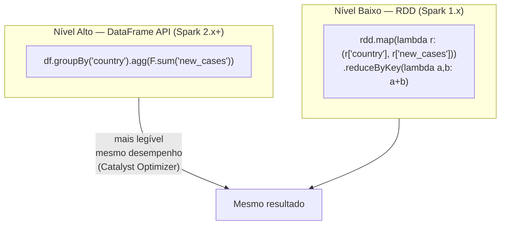

---

## 7. Guia de Apresentação em Sala

### Roteiro sugerido (15-20 minutos)

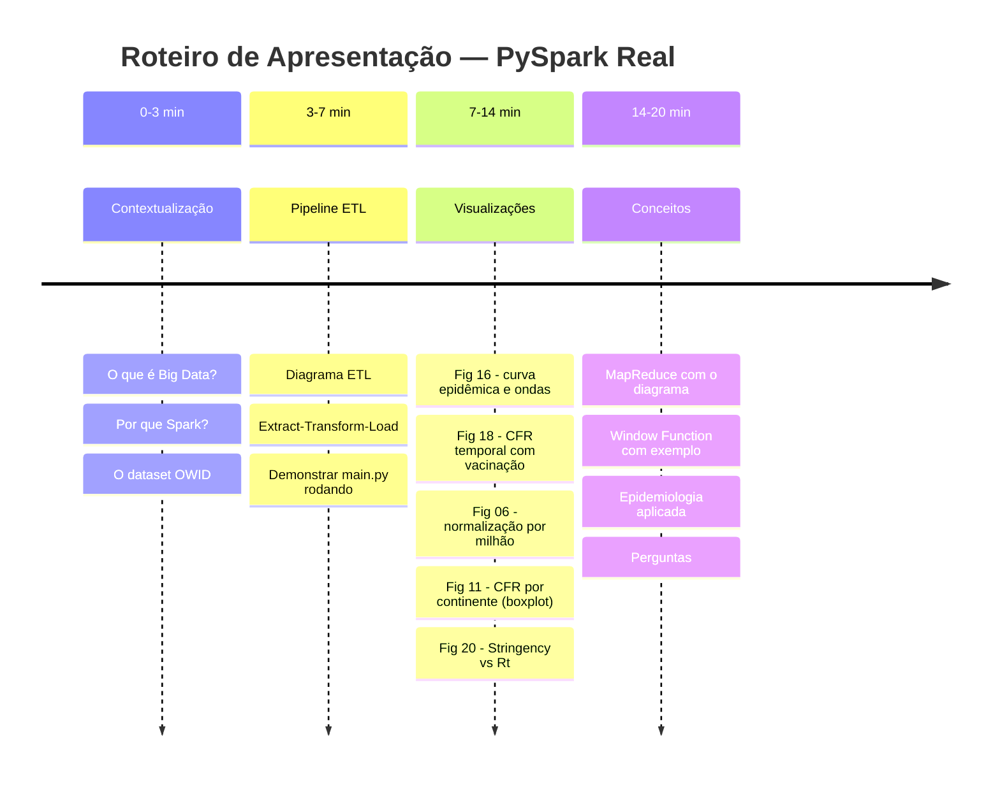

### Perguntas frequentes e respostas

| Pergunta | Resposta |
|---|---|
| "Por que Spark e não Pandas?" | Pandas carrega tudo em memória de uma máquina. Spark processa em partições distribuídas — o mesmo código escala para bilhões de linhas em cluster sem reescrever nada. |
| "Por que Window Function para média móvel?" | Demonstra SQL analítico que existe em todos os bancos modernos (PostgreSQL, BigQuery, Snowflake). É uma habilidade transferível para qualquer plataforma. |
| "O dataset é confiável?" | É do Our World in Data (Oxford/Global Change Data Lab), referência global. Limitação: países com pouca testagem têm dados subestimados. |
| "Por que o Spark rodou localmente?" | Spark funciona em modo local para desenvolvimento. Em produção, o mesmo código rodaria em AWS EMR, Databricks ou Google Dataproc sem modificações. |
| "CFR alto = sistema de saúde ruim?" | Não necessariamente — CFR alto pode indicar poucos testes (subnotificação). Precisa ser lido com contexto. |

---

*Documentação — EDA COVID-19 com PySpark Real — UVV — Abril/2026*
