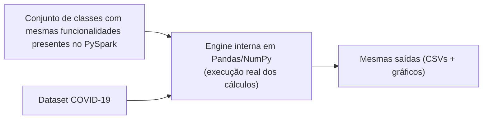
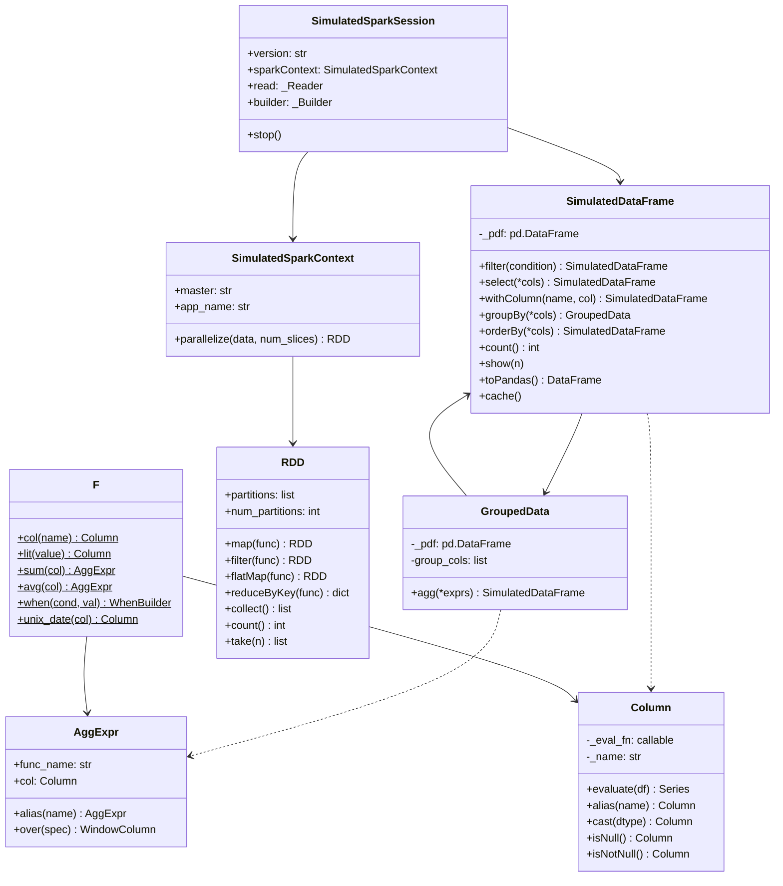
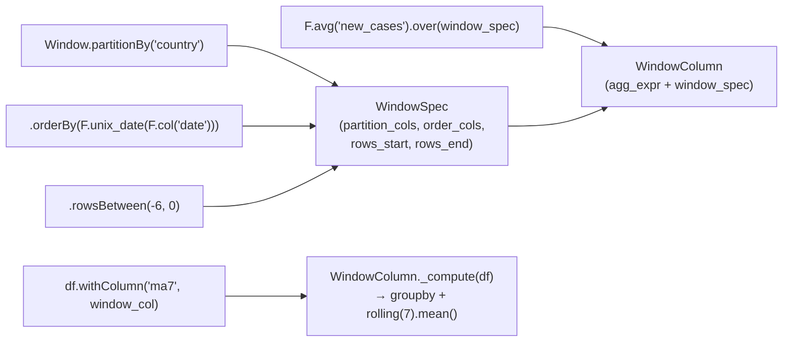
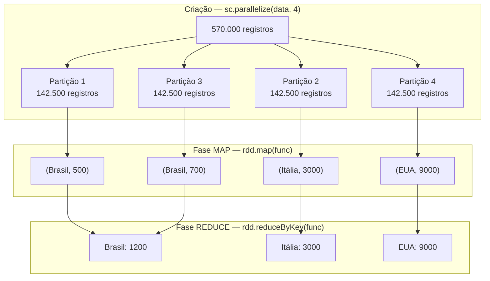
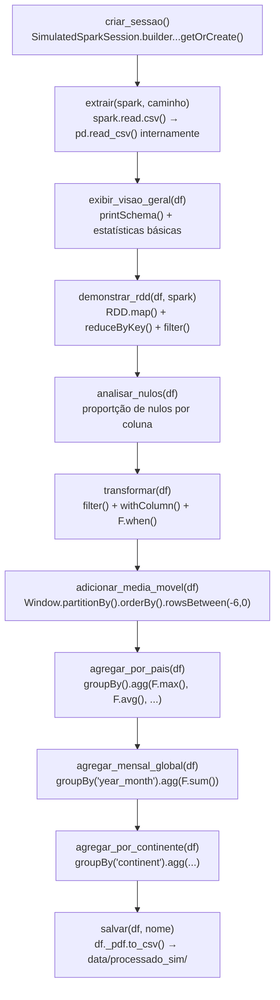

# Documentação: *simulação do Apache Spark*


> Esta documentação cobre os arquivos da **simulação**: `src/main_simulado.py` e `notebook/simulacao.ipynb`.

---

# Configurações locais

Para este projeto estamos utilizando o seguinte setup:

```bash
conda create -n bigdata_env python=3.12
conda activate bigdata_env
pip install -r requirements.txt
```

---

## Visão geral
O projeto desenvolvido **simula em Python o funcionamento do Apache Spark**, implementando uma solução simplificada que representa seus principais conceitos como o processamento distribuído.

### Simulamos os conceitos de: 
  1. **RDD:** Resilient Distributed Dataset com partições em memória
  2. **Map/Filter:** transformações elemento a elemento sobre partições
  3. **ReduceByKey:** agregação por chave (coração do MapReduce)
  4. **DataFrame API:** groupBy, agg, filter, withColumn, select, orderBy
  5. **Column:** expressões de coluna tipadas (operadores, null-checks)
  6. **Window Function:** média móvel por partição ordenada por data
  7. **SparkSession:** ponto de entrada único que orquestra tudo
  8. **Lazy Evaluation:** transformações registradas; execução adiada para ação

Fluxo da solução:



O código usa a mesma API que o PySpark real (`spark.read.csv()`, `df.filter()`, `F.sum()`, `Window.partitionBy()`)

---

## 2. Arquitetura da Simulação



---

## 3. Engine de Simulação

A Parte 1 do arquivo `src/main_simulado.py` contém todas as classes da engine, nas linhas ~40 a ~920.

### 3.1 Column — Expressões de Coluna

A classe `Column` é o núcleo da simulação. Ela **armazena uma função** (`eval_fn`) que só é executada quando necessário — implementando o conceito de **Lazy Evaluation**.

```python
class Column:
    def __init__(self, eval_fn, name="expr"):
        self._eval_fn = eval_fn   # função guardada, não executada ainda
        self._name    = name

    def evaluate(self, df: pd.DataFrame) -> pd.Series:
        return self._eval_fn(df)  # execução adiada — só aqui os dados são processados
```

**Por que closures com argumento default?**

```python
# PROBLEMA: closure tardio — todas as colunas usariam o último valor de 'x'
cols = [Column(lambda df: df[x]) for x in colunas]

# SOLUÇÃO: captura por valor com argumento default
cols = [Column(lambda df, _n=x: df[_n]) for x in colunas]
```

Operadores como `+`, `-`, `>`, `&` retornam novos `Column` — compondo expressões sem executar nada:

```python
# Isso não calcula nada ainda:
expr = (F.col("new_deaths") / F.col("new_cases") * 100)

# O cálculo real só acontece quando:
series = expr.evaluate(df_pandas)
```

---

### 3.2 AggExpr — Expressões de Agregação

```python
class AggExpr:
    def __init__(self, func_name: str, col, alias_name: str = None):
        self.func_name = func_name   # "sum", "avg", "max", "min", etc.
        self.col       = col         # Column ou string
        self._alias    = alias_name

    def over(self, window_spec) -> WindowColumn:
        # Converte a AggExpr em WindowColumn quando usada com .over()
        return WindowColumn(self, window_spec)
```

`AggExpr` representa uma agregação que ainda não foi calculada. Ela só é executada dentro do `GroupedData.agg()` — outro exemplo de lazy evaluation.

---

### 3.3 WhenBuilder — Expressões Condicionais

```python
# Equivalente exato ao PySpark:
# F.when(cond1, val1).when(cond2, val2).otherwise(default)

expr = (
    F.when(
        (F.col("new_cases") > 0) & F.col("new_deaths").isNotNull(),
        F.col("new_deaths") / F.col("new_cases") * 100
    )
    .otherwise(F.lit(None))
)
```

Internamente percorre os ramos em ordem — a primeira condição verdadeira vence, sem avaliar as demais (short-circuit evaluation).

---

### 3.4 Window Function

A Window Function é um dos conceitos mais avançados do Spark. A simulação a implementa em três classes:



**Como `_compute()` funciona internamente:**

```python
def _compute(self, df: pd.DataFrame) -> pd.Series:
    # 1. Adiciona colunas de ordenação que são expressões (ex: unix_date(date))
    for col_name, col_expr in zip(spec.order_cols, spec.order_col_exprs):
        if col_expr is not None and col_name not in df.columns:
            df[col_name] = col_expr.evaluate(df)

    # 2. Itera por cada partição (país)
    for _, grupo_df in df.groupby(spec.partition_cols):
        sorted_df = grupo_df.sort_values(spec.order_cols)  # ordena por data

        # 3. Aplica rolling window — simula rowsBetween(-6, 0)
        agg_vals = sorted_df[col_name].rolling(window=7, min_periods=1).mean()

        result[sorted_df.index] = agg_vals.values
```

---

### 3.5 GroupedData — Agrupamento

```python
# PySpark real:
df.groupBy("country", "continent").agg(F.max("total_cases").alias("total"))

# Simulação — mesma sintaxe:
df.groupBy("country", "continent").agg(F.max("total_cases").alias("total"))
```

Internamente, cada `AggExpr` é calculada como uma operação `pandas.GroupBy` independente e os resultados são unidos por `merge`. Isso simula o plano de execução paralelo do Spark onde diferentes agregações podem ser computadas simultaneamente.

---

### 3.6 SimulatedDataFrame — API de Alto Nível

```python
# Internamente usa pandas, mas expõe a API do Spark:
class SimulatedDataFrame:
    def __init__(self, pdf: pd.DataFrame):
        self._pdf = pdf  # pandas DataFrame interno

    def filter(self, condition) -> "SimulatedDataFrame":
        mask = condition.evaluate(self._pdf)   # avalia a Column
        return SimulatedDataFrame(self._pdf[mask].copy())  # retorna NOVO df

    def withColumn(self, name, col) -> "SimulatedDataFrame":
        new_pdf = self._pdf.copy()
        new_pdf[name] = col.evaluate(new_pdf)  # adiciona coluna calculada
        return SimulatedDataFrame(new_pdf)      # imutabilidade simulada
```

**Imutabilidade:** cada transformação retorna um **novo** `SimulatedDataFrame` — exatamente como no Spark real, onde DataFrames são imutáveis.

---

### 3.7 RDD — Processamento de Baixo Nível

O RDD (Resilient Distributed Dataset) é a abstração de baixo nível do Spark. A simulação divide os dados em **partições** (listas Python) e aplica as operações em cada uma:



```python
# Demonstração de todos os conceitos RDD no notebook:

rdd_covid = spark.sparkContext.parallelize(registros, num_slices=4)

# MAP — transforma cada elemento
rdd_pares = rdd_covid.map(
    lambda r: (r["country"], r["new_cases"] or 0)
)

# FILTER — mantém apenas registros com mais de 10.000 casos
rdd_alto = rdd_covid.filter(lambda r: r["new_cases"] > 10_000)

# REDUCEBY KEY — soma por país (SHUFFLE + REDUCE)
total_por_pais = rdd_pares.reduceByKey(lambda valores: sum(valores))
```

---

### 3.8 SparkContext e SparkSession

```python
# API idêntica ao PySpark real:
spark = (
    SimulatedSparkSession.builder
    .appName("EDA_COVID19_Simulado")
    .master("local[*]")
    .config("spark.sql.shuffle.partitions", "8")
    .getOrCreate()
)

df = spark.read.csv("data/owid-covid.csv")
sc = spark.sparkContext
rdd = sc.parallelize(lista_de_dados, num_slices=4)
```

O padrão `builder.appName().master().getOrCreate()` é **idêntico** ao PySpark. Internamente, `spark.read.csv()` usa `pd.read_csv()` — a "magia" está no fato de que o código do usuário não precisa saber disso.

---

### 3.9 F — Namespace de Funções

```python
class F:
    @staticmethod
    def col(name: str) -> Column: ...         # referência a coluna
    @staticmethod
    def lit(value) -> Column: ...             # valor constante
    @staticmethod
    def sum(col) -> AggExpr: ...              # soma
    @staticmethod
    def avg(col) -> AggExpr: ...              # média
    @staticmethod
    def max(col) -> AggExpr: ...              # máximo
    @staticmethod
    def min(col) -> AggExpr: ...              # mínimo
    @staticmethod
    def count(col="*") -> AggExpr: ...        # contagem
    @staticmethod
    def countDistinct(col) -> AggExpr: ...    # contagem distinta
    @staticmethod
    def when(condition, value) -> WhenBuilder: ...  # condicional
    @staticmethod
    def to_date(col, fmt=None) -> Column: ... # converte para data
    @staticmethod
    def year(col) -> Column: ...              # extrai ano
    @staticmethod
    def date_format(col, fmt) -> Column: ...  # formata data
    @staticmethod
    def unix_date(col) -> Column: ...         # dias desde 1970-01-01
    @staticmethod
    def abs(col) -> Column: ...               # valor absoluto
```

---

## 4. Pipeline ETL — Parte 2

A Parte 2 de `main_simulado.py` (linhas ~922 em diante) aplica a engine ao dataset COVID-19. O pipeline é **idêntico** ao do `main.py` real — apenas usando as classes simuladas.



**Saídas geradas em `data/processado_sim/`:**

| Arquivo | Conteúdo |
|---|---|
| `resumo_por_pais_sim.csv` | Métricas agregadas por país (239 países) |
| `evolucao_mensal_sim.csv` | Casos e mortes mensais globais (74 meses) |
| `resumo_continente_sim.csv` | Totais por continente (6 continentes) |

---

## 5. Notebook `simulacao.ipynb`

O notebook usa exclusivamente as classes de `main_simulado.py` para processamento. Nenhuma linha importa PySpark ou depende de Java.

```mermaid
flowchart TD
    S0["Seção 0\nImporta SimulatedSparkSession, F, Window\nde ../src/main_simulado.py"]
    S1["Seção 1\nSparkSession & Extract\ncria sessão + lê CSV"]
    S2["Seção 2\nQualidade dos Dados\n01_valores_nulos_sim.png"]
    S3["Seção 3\nTransform\nfilter + withColumn + Window Function"]
    S4["Seção 4\nAgregações\ngroupBy + agg por país, continente, mês"]
    S5["Seção 5\nRDD / MapReduce\nmap + reduceByKey + 02_mapreduce_sim.png"]
    S6["Seção 6\nEvolução Global\n03_evolucao_global_sim.png"]
    S7["Seção 7\nEvolução Mensal\n04_evolucao_mensal_sim.png"]
    S8["Seção 8\nTop 15 Países\n05 a 07_sim.png"]
    S9["Seção 9\nAnálise por Continente\n08 e 09_sim.png"]
    S10["Seção 10\nVacinação\n10 e 11_sim.png"]
    S11["Seção 11\nCFR\n12_cfr_continente_sim.png"]
    S12["Seção 12\nCorrelação\n13_correlacao_sim.png"]
    S13["Seção 13\nPIB vs Vacinação\n14_pib_vs_vacinacao_sim.png"]
    S14["Seção 14\nTaxa de Reprodução\n15_taxa_reproducao_sim.png"]
    S15["Seção 15\nÍndice de Rigidez\n16_indice_rigidez_sim.png"]
    S16["Seção 16\nMédia Móvel por País\n17_media_movel_paises_sim.png"]
    S17["Seção 17\nLoad\nsalva CSVs em data/processado_sim/"]

    S0 --> S1 --> S2 --> S3 --> S4 --> S5 --> S6 --> S7 --> S8 --> S9 --> S10 --> S11 --> S12 --> S13 --> S14 --> S15 --> S16 --> S17
```



---

## 6. As 17 Visualizações

### 01 — Valores Nulos por Coluna (`01_valores_nulos_sim.png`)
**Conceito:** `Column.isNull()` | **Como:** Calcula `pdf[c].isna().sum()` por coluna.
Mostra a proporção de dados ausentes — colunas hospitalares têm 93% de nulos pois só países ricos reportavam dados de UTI.

### 02 — MapReduce — Top 10 Países (`02_mapreduce_sim.png`)
**Conceito:** `RDD.map()` + `RDD.reduceByKey()` | **Como:** Cria pares `(país, casos)` via MAP, soma por chave via REDUCE.
Visualiza o resultado do pipeline MapReduce — a mesma operação que o Spark real executaria distribuída em um cluster.

### 03 — Evolução Global Diária (`03_evolucao_global_sim.png`)
**Conceito:** Window Function rolling 7 dias | **Como:** `pandas.rolling(7).mean()` por país.
Dois subgráficos (casos e mortes) com área + média móvel. O pico de Ômicron (Jan/2022) é claramente visível com mortalidade proporcionalmente menor que os picos anteriores.

### 04 — Evolução Mensal Global (`04_evolucao_mensal_sim.png`)
**Conceito:** `groupBy("year_month").agg(F.sum("new_cases"))` | **Como:** `GroupedData.agg()`.
Barras mensais com eixo duplo (casos + mortes). Permite identificar as fases da pandemia em granularidade mensal.

### 05 — Top 15 Países por Total de Casos (`05_top15_casos_sim.png`)
**Conceito:** `F.max("total_cases")` por país | **Colorido por continente.**
Ranking absoluto — favorece países grandes. Justificativa para as métricas normalizadas.

### 06 — Top 15 Países por Total de Mortes (`06_top15_mortes_sim.png`)
**Conceito:** `F.max("total_deaths")` por país.
Comparar com figura 05 revela diferenças na capacidade de resposta de cada sistema de saúde.

### 07 — Top 15 por Mortes por Milhão (`07_top15_mortes_por_milhao_sim.png`)
**Conceito:** `total_deaths / population * 1_000_000`.
Métrica normalizada que permite comparar países independente do tamanho populacional.

### 08 — Casos e Mortes por Continente (`08_analise_continentes_sim.png`)
**Conceito:** `groupBy("continent").agg(F.max(...))`.
Dois gráficos lado a lado (absoluto vs. por continente).

### 09 — Evolução por Continente no Tempo (`09_casos_por_continente_tempo_sim.png`)
**Conceito:** `groupBy(["continent", "year_month"]).agg(F.sum("new_cases"))`.
Linhas múltiplas — mostra que as ondas não foram simultâneas entre continentes.

### 10 — Vacinação Global (`10_vacinacao_global_sim.png`)
**Conceito:** `people_fully_vaccinated / population * 100`.
Área temporal com marcos de cobertura (25%, 50%, 70%). O **antes e depois** da vacinação é visível comparando com a figura 03.

### 11 — Top 20 Países por Vacinação (`11_top20_vacinacao_sim.png`)
**Conceito:** `F.max("people_fully_vaccinated") / population * 100`.
Barras horizontais por continente — revela desigualdade global no acesso a vacinas.

### 12 — CFR por Continente (`12_cfr_continente_sim.png`)
**Conceito:** `total_deaths / total_cases * 100` | **Tipo:** Boxplot.
A distribuição revela tanto a mediana de cada continente quanto os outliers — países com CFR muito diferente do padrão continental.

### 13 — Correlação Socioeconômica (`13_correlacao_socioeconomica_sim.png`)
**Conceito:** `df.corr()` sobre variáveis normalizadas por população.
Heatmap com coeficientes de Pearson. Responde: "países mais ricos vacinaram mais?" (sim), "PIB reduz mortalidade?" (sim, moderadamente).

### 14 — PIB per Capita vs. Vacinação (`14_pib_vs_vacinacao_sim.png`)
**Conceito:** Scatter com linha de tendência (`numpy.polyfit`).
Cada ponto é um país. A tendência confirma correlação positiva entre riqueza e cobertura vacinal, com exceções visíveis.

### 15 — Taxa de Reprodução Rt (`15_taxa_reproducao_sim.png`)
**Conceito:** Média móvel 14 dias com faixas de crescimento/controle.

```
Rt > 1 → pandemia crescendo (faixa vermelha)
Rt ≤ 1 → pandemia recuando (faixa verde)
```

### 16 — Índice de Rigidez por Continente (`16_indice_rigidez_sim.png`)
**Conceito:** `F.avg("stringency_index")` por continente ao longo do tempo.
Linhas múltiplas com anotação da declaração da pandemia (11/03/2020). Mostra como cada continente respondeu com restrições.

### 17 — Média Móvel por País (`17_media_movel_paises_sim.png`)
**Conceito:** `Window.partitionBy("country").orderBy("date").rowsBetween(-6, 0)`.
Um subgráfico por país (Brasil, EUA, Índia, Alemanha, Japão) — demonstração explícita da Window Function simulada com dados reais.

---

## 7. Comparativo: Simulação vs. PySpark Real

| Aspecto | PySpark Real (`main.py`) | Simulação (`main_simulado.py`) |
|---|---|---|
| **Dependências** | PySpark 4.1.1 + Java 21 | Apenas pandas + numpy |
| **SparkSession** | JVM real, modo `local[*]` | Objeto Python puro |
| **DataFrame** | Spark DataFrame distribuído | `SimulatedDataFrame` (pandas interno) |
| **groupBy + agg** | Catalyst Optimizer + execução paralela | `pandas.GroupBy.agg()` |
| **Window Function** | SQL analítico com partições JVM | `pandas.groupby().rolling()` |
| **RDD** | Partições reais em JVM | Listas Python particionadas |
| **Lazy Evaluation** | Catalyst registra o DAG | Closures armazenam `eval_fn` |
| **Saída** | `data/processado/` | `data/processado_sim/` |
| **Figuras** | `figuras/*.png` | `figuras/*_sim.png` |
| **Escalabilidade** | Escala para cluster distribuído | Limitado à memória de uma máquina |
| **API do usuário** | Idêntica ao padrão Spark | Idêntica ao padrão Spark |

**O que a simulação ensina que o PySpark real não deixa claro:**

Ao usar PySpark, o desenvolvedor não vê o que acontece "por baixo". A simulação **expõe a implementação**: é possível ver exatamente como `F.sum()` vira um `GroupBy.sum()` do pandas, como `Window.partitionBy()` se torna um `groupby().rolling()`, e como `Column` guarda uma closure que só é executada no momento da ação.

---

