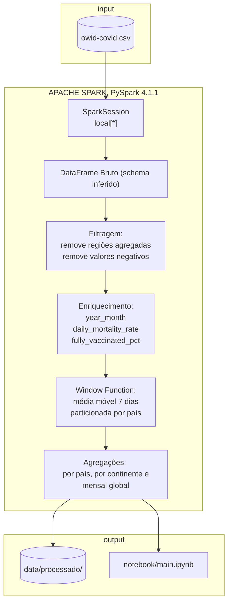
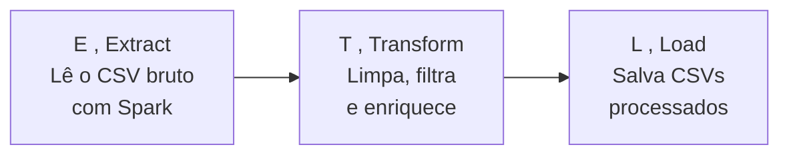
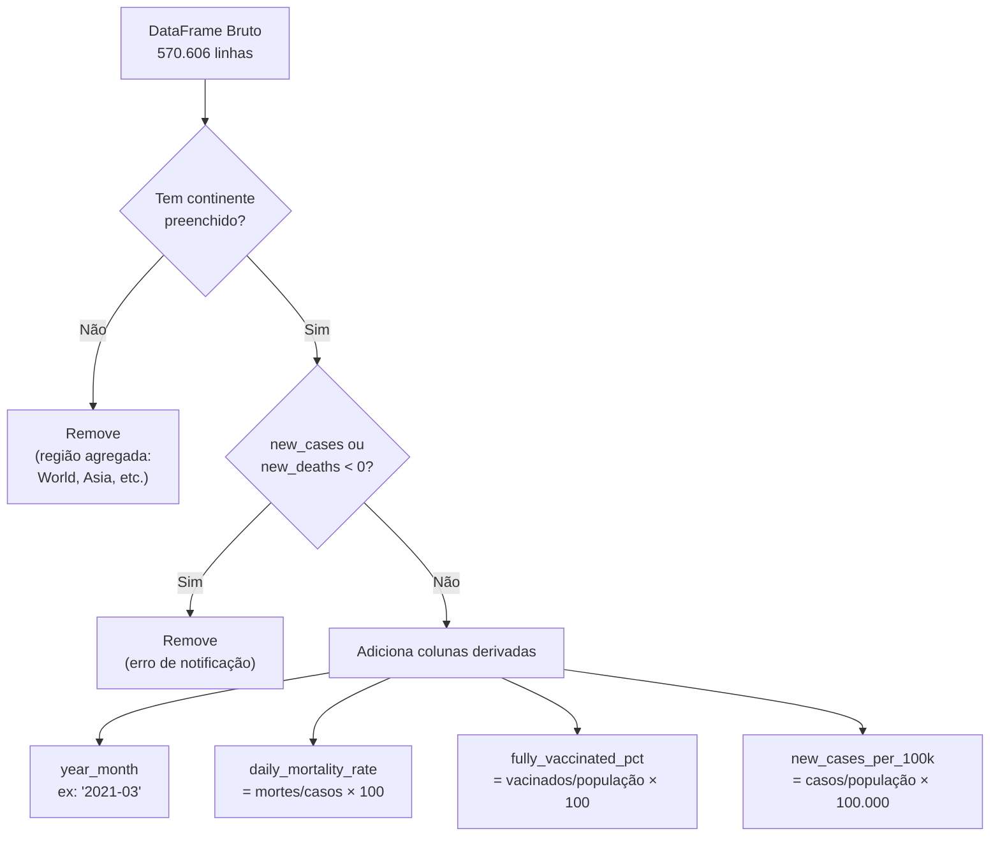
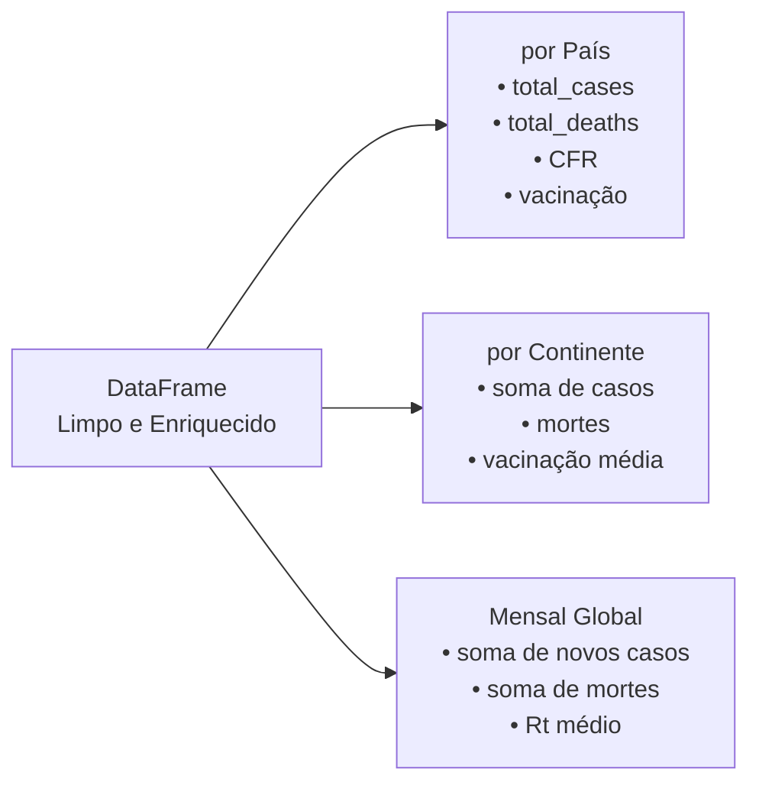

# Documentação Técnica: EDA COVID-19 com Apache Spark

---

## Visão Geral

O projeto realiza uma **Análise Exploratória de Dados (EDA)** sobre a pandemia de COVID-19 usando o **Apache Spark** (via PySpark) para processar um dataset de grande volume.

| Arquivo | Papel |
|---|---|
| `src/main.py` | Pipeline ETL |
| `notebook/main.ipynb` | Análise interativa com visualizações |

---

## 2. Arquitetura e Fluxo de Dados



---

## 3. Pipeline ETL

O arquivo implementa as três fases clássicas de processamento de dados:



---

---

### Extração

```python
df = (
    spark.read
    .option("header", "true")
    .option("inferSchema", "true")
    .csv(caminho)
)
df = df.withColumn("date", F.to_date(F.col("date"), "yyyy-MM-dd"))
```

O Spark lê o CSV de forma distribuída (internamente divide o arquivo em **partições** processadas em paralelo nos núcleos da CPU,`inferSchema` faz o Spark amostrar os dados para detectar tipos automaticamente).

**Resultado:** DataFrame com 570.606 linhas × 61 colunas, totalmente tipado.

---

### Análise de Qualidade dos Dados

```python
exprs_nulos = [
    F.sum(F.col(c).isNull().cast("int")).alias(c)
    for c in colunas_interesse
]
resultado = df.agg(*exprs_nulos).collect()[0].asDict()
```

Em vez de fazer uma query por coluna (61 queries), constrói **uma lista de expressões** e executa tudo em uma única passagem. Isso é possível pelo modelo de **Lazy Evaluation** do Spark.

**Principais achados:**

| Coluna | % Nulos | Motivo |
|---|---|---|
| `icu_patients` | 93% | Poucos países reportam UTI diariamente |
| `hosp_patients` | 93% | Hospitalizações |
| `people_fully_vaccinated` | 87% | Vacinação começou apenas em Dez/2020 |
| `reproduction_rate` | 68% | Estimativa complexa, nem sempre calculada |
| `new_cases` | 3% | Registros antes do início da pandemia |

---

### Transformação



O dataset OWID inclui registros como `"World"`, `"High income"`, `"European Union"` que são **somas de países** — mantê-los duplicaria os dados nas análises.

---

### Window Function 

```python
window_spec = (
    Window
    .partitionBy("country")               # cada país é independente
    .orderBy(F.unix_date(F.col("date")))  # ordena por data
    .rowsBetween(-6, 0)                   # janela: 7 dias
)
df = df.withColumn("new_cases_ma7", F.avg("new_cases").over(window_spec))
```

A Window Function calcula um valor para cada linha levando em conta **linhas vizinhas** 

---

### Agregações Analíticas



---

### Carga 

```python
df.coalesce(1).write.mode("overwrite").option("header", "true").csv(destino)
```

- `coalesce(1)` — consolida todas as partições em um único arquivo CSV
- `mode("overwrite")` — substitui execuções anteriores automaticamente
- Saída em `data/processado/` (não versionado no Git por exceder 100 MB)

---


