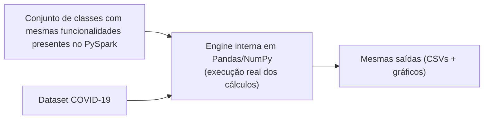
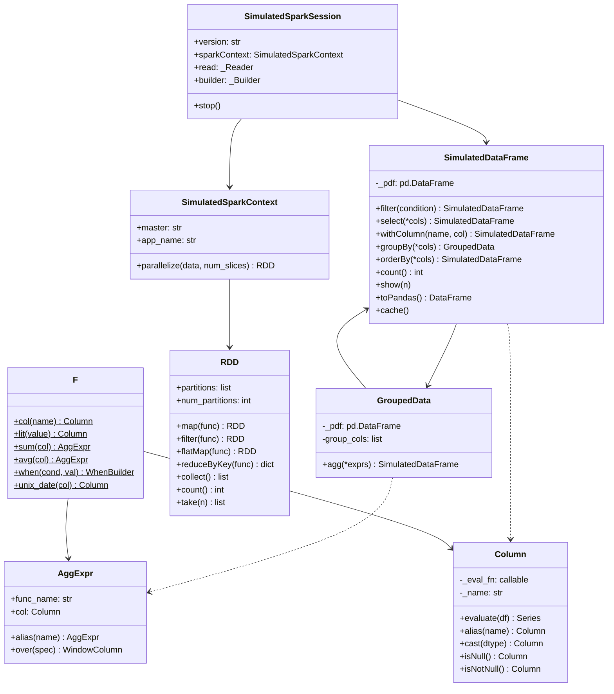
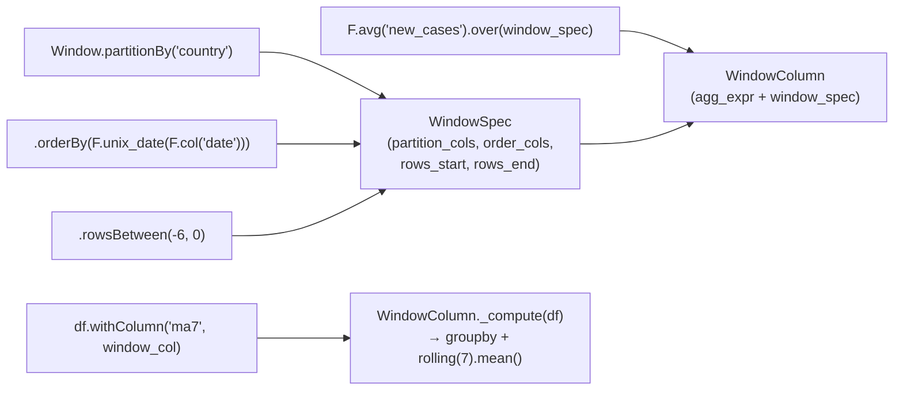
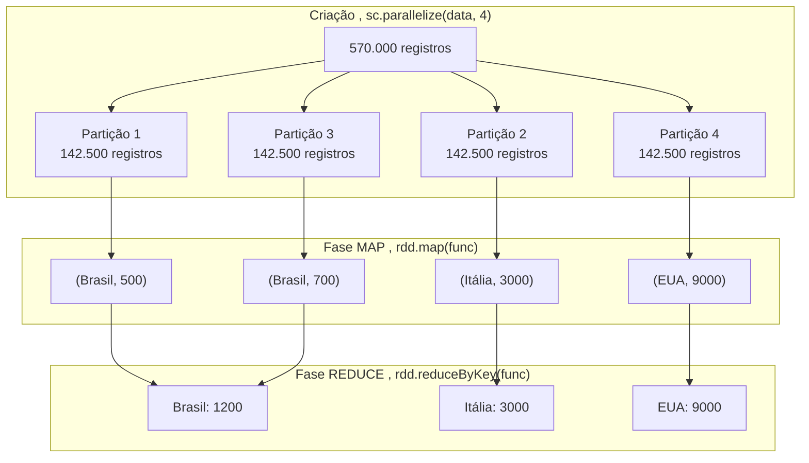
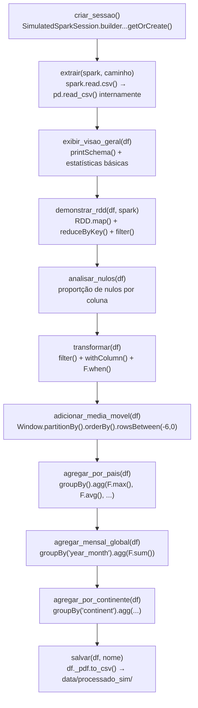

# Documentação: *simulação do Apache Spark*


> Esta documentação cobre os arquivos da **simulação**: `src/main_simulado.py` e `notebook/simulacao.ipynb`.

---

# Configurações locais

Para este projeto estamos utilizando o seguinte setup:

```bash
conda create -n bigdata_env python=3.12
conda activate bigdata_env
pip install -r requirements.txt
```

---

## Visão geral
O projeto desenvolvido **simula em Python o funcionamento do Apache Spark**, implementando uma solução simplificada que representa seus principais conceitos como o processamento distribuído.

### Simulamos os conceitos de: 
  1. **RDD:** Resilient Distributed Dataset com partições em memória
  2. **Map/Filter:** transformações elemento a elemento sobre partições
  3. **ReduceByKey:** agregação por chave (coração do MapReduce)
  4. **DataFrame API:** groupBy, agg, filter, withColumn, select, orderBy
  5. **Column:** expressões de coluna tipadas (operadores, null-checks)
  6. **Window Function:** média móvel por partição ordenada por data
  7. **SparkSession:** ponto de entrada único que orquestra tudo
  8. **Lazy Evaluation:** transformações registradas; execução adiada para ação

Fluxo da solução:



O código usa a mesma API que o PySpark real (`spark.read.csv()`, `df.filter()`, `F.sum()`, `Window.partitionBy()`)

---

## Arquitetura da Simulação



---

## Engine de Simulação

A Parte 1 do arquivo `src/main_simulado.py` contém todas as classes da engine, nas linhas ~40 a ~920.

### Expressões de Coluna

A classe `Column` é o núcleo da simulação. Ela **armazena uma função** (`eval_fn`) que só é executada quando necessário — implementando o conceito de **Lazy Evaluation**.

```python
class Column:
    def __init__(self, eval_fn, name="expr"):
        self._eval_fn = eval_fn   # função guardada, não executada ainda
        self._name    = name

    def evaluate(self, df: pd.DataFrame) -> pd.Series:
        return self._eval_fn(df)  # execução adiada — só aqui os dados são processados
```

---

### AggExpr: expressões de agregação

```python
class AggExpr:
    def __init__(self, func_name: str, col, alias_name: str = None):
        self.func_name = func_name   # "sum", "avg", "max", "min", etc.
        self.col       = col         # Column ou string
        self._alias    = alias_name

    def over(self, window_spec) -> WindowColumn:
        # Converte a AggExpr em WindowColumn quando usada com .over()
        return WindowColumn(self, window_spec)
```

`AggExpr` representa uma agregação que ainda não foi calculada. Ela só é executada dentro do `GroupedData.agg()`

---

### WhenBuilder: expressões condicionais

```python

expr = (
    F.when(
        (F.col("new_cases") > 0) & F.col("new_deaths").isNotNull(),
        F.col("new_deaths") / F.col("new_cases") * 100
    )
    .otherwise(F.lit(None))
)
```

Internamente percorre os ramos em ordem — a primeira condição verdadeira vence, sem avaliar as demais (short-circuit evaluation).

---

### Window Function

A Window Function é um dos conceitos mais avançados do Spark. A simulação a implementa em três classes:



**Como `_compute()` funciona internamente:**

```python
def _compute(self, df: pd.DataFrame) -> pd.Series:
    # 1. Adiciona colunas de ordenação que são expressões (ex: unix_date(date))
    for col_name, col_expr in zip(spec.order_cols, spec.order_col_exprs):
        if col_expr is not None and col_name not in df.columns:
            df[col_name] = col_expr.evaluate(df)

    # 2. Itera por cada partição (país)
    for _, grupo_df in df.groupby(spec.partition_cols):
        sorted_df = grupo_df.sort_values(spec.order_cols)  # ordena por data

        # 3. Aplica rolling window — simula rowsBetween(-6, 0)
        agg_vals = sorted_df[col_name].rolling(window=7, min_periods=1).mean()

        result[sorted_df.index] = agg_vals.values
```

---

### GroupedData: Agrupamento

```python
# PySpark real:
df.groupBy("country", "continent").agg(F.max("total_cases").alias("total"))

# Simulação — mesma sintaxe:
df.groupBy("country", "continent").agg(F.max("total_cases").alias("total"))
```

Internamente, cada `AggExpr` é calculada como uma operação `pandas.GroupBy` independente e os resultados são unidos por `merge`. Isso simula o plano de execução paralelo do Spark onde diferentes agregações podem ser computadas simultaneamente.

---

### SimulatedDataFrame 

```python
class SimulatedDataFrame:
    def __init__(self, pdf: pd.DataFrame):
        self._pdf = pdf  # pandas DataFrame interno

    def filter(self, condition) -> "SimulatedDataFrame":
        mask = condition.evaluate(self._pdf)   # avalia a Column
        return SimulatedDataFrame(self._pdf[mask].copy())  # retorna NOVO df

    def withColumn(self, name, col) -> "SimulatedDataFrame":
        new_pdf = self._pdf.copy()
        new_pdf[name] = col.evaluate(new_pdf)  # adiciona coluna calculada
        return SimulatedDataFrame(new_pdf)      # imutabilidade simulada
```

**Imutabilidade:** cada transformação retorna um **novo** `SimulatedDataFrame` — exatamente como no Spark real, onde DataFrames são imutáveis.

---

### RDD: processamento de baixo nível

O RDD (Resilient Distributed Dataset) é a abstração de baixo nível do Spark. A simulação divide os dados em **partições** (listas Python) e aplica as operações em cada uma:



---

### SparkContext e SparkSession

```python
# API idêntica ao PySpark real:
spark = (
    SimulatedSparkSession.builder
    .appName("EDA_COVID19_Simulado")
    .master("local[*]")
    .config("spark.sql.shuffle.partitions", "8")
    .getOrCreate()
)

df = spark.read.csv("data/owid-covid.csv")
sc = spark.sparkContext
rdd = sc.parallelize(lista_de_dados, num_slices=4)
```

O padrão `builder.appName().master().getOrCreate()` é **idêntico** ao PySpark. Internamente, `spark.read.csv()` usa `pd.read_csv()` — a "magia" está no fato de que o código do usuário não precisa saber disso.

---

### F: namespace de funções

```python
class F:
    @staticmethod
    def col(name: str) -> Column: ...         # referência a coluna
    @staticmethod
    def lit(value) -> Column: ...             # valor constante
    @staticmethod
    def sum(col) -> AggExpr: ...              # soma
    @staticmethod
    def avg(col) -> AggExpr: ...              # média
    @staticmethod
    def max(col) -> AggExpr: ...              # máximo
    @staticmethod
    def min(col) -> AggExpr: ...              # mínimo
    @staticmethod
    def count(col="*") -> AggExpr: ...        # contagem
    @staticmethod
    def countDistinct(col) -> AggExpr: ...    # contagem distinta
    @staticmethod
    def when(condition, value) -> WhenBuilder: ...  # condicional
    @staticmethod
    def to_date(col, fmt=None) -> Column: ... # converte para data
    @staticmethod
    def year(col) -> Column: ...              # extrai ano
    @staticmethod
    def date_format(col, fmt) -> Column: ...  # formata data
    @staticmethod
    def unix_date(col) -> Column: ...         # dias desde 1970-01-01
    @staticmethod
    def abs(col) -> Column: ...               # valor absoluto
```

---

## Pipeline ETL 



**Saídas geradas em `data/processado_sim/`:**

| Arquivo | Conteúdo |
|---|---|
| `resumo_por_pais_sim.csv` | Métricas agregadas por país (239 países) |
| `evolucao_mensal_sim.csv` | Casos e mortes mensais globais (74 meses) |
| `resumo_continente_sim.csv` | Totais por continente (6 continentes) |


---

